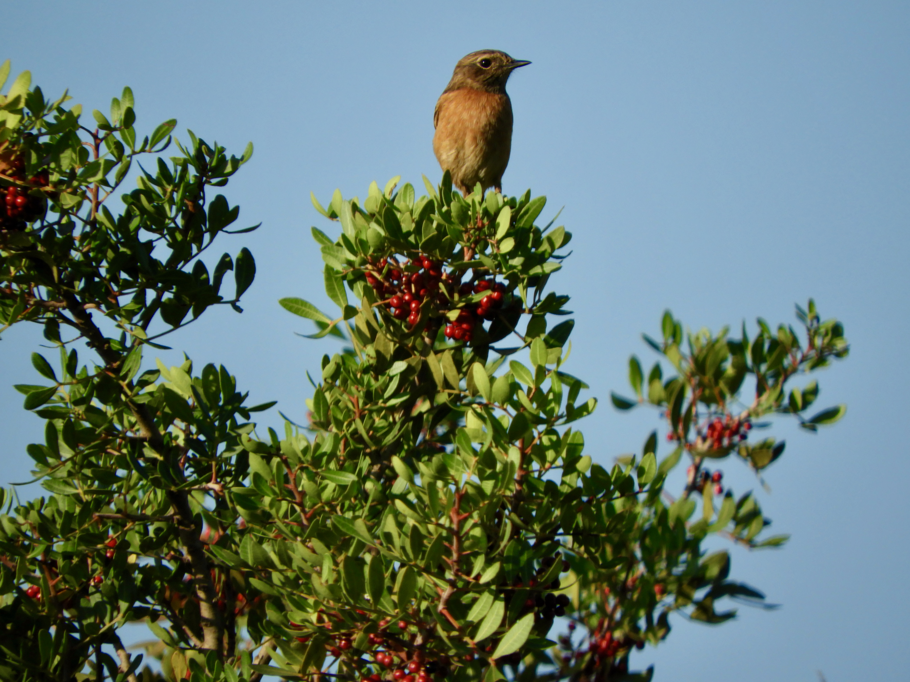

# Individual-based networks

Repository containing dataset and code for the manuscript entitled _**Downscaling mutualistic networks from species to individuals reveals consistent interaction niches and roles within plant populations**_.

Authors: Elena Quintero1,2, Blanca Arroyo-Correa1, Jorge Isla1, Francisco Rodríguez-Sánchez2, Pedro Jordano1,2

1 Integrative Ecology Group, Estación Biológica de Doñana, EBD-CSIC, Av. Américo Vespucio 26, E-41092 Sevilla, Spain.

2 Departamento de Biología Vegetal y Ecología, Facultad de Biología, Universidad de Sevilla, Av. Reina Mercedes, E-41012 Sevilla, Spain.

Contact: Elena Quintero ([elenaquintero.qb\@gmail.com](mailto:elenaquintero.qb@gmail.com)).

Download the last release: [Releases](https://github.com/PJordano-Lab/MS_individual-based_networks/releases/).

For this study, we compiled 46 empirical individual-based networks on plant-animal seed dispersal mutualism, encompassing 1037 plant individuals across 29 species from various regions. We compare the structure of individual-based networks to that of species-based networks and by extending the niche concept to interaction assemblages, we explore levels of individual plant specialization. We examine how individual variation influences network structure and how plant individuals "explore" the interaction niche of the population.

Please refer to [**makefile.R**](makefile.R) for project outline, explanation and codes used, and to the [**README**](networks/README.md) in networks folder for data structure and compilation.
