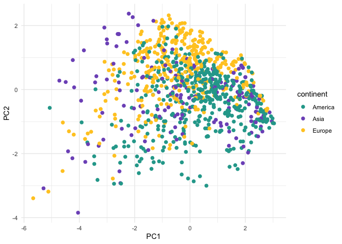

3d_PCA
================
Elena Quintero
2024-02-07

``` r
library(here)
library(tidyverse)
library(tidylog)
library(magrittr)
library(rcartocolor)
library(patchwork)
library(ggalt)
library(psych)
library(ggfortify)
library(ggrepel)
library(gridExtra)
library(ggnewscale)
theme_set(theme_minimal())
```

### INDIVIDUAL-NODE LEVEL:

``` r
ind.level.df <- read.csv(here("data/node.level.selection.csv"))

#Normalization function:
min_max_norm <- function(x){(x-min(x))/(max(x)-min(x))}

ind.level.df %<>% 
  group_by(net_id) %>% 
  mutate(species.strength.norm = min_max_norm(species.strength)) #normalize species
```

Load net colors:

``` r
net_cols <- read_csv(here("data/net_colors.csv"))

mycols <- as.character(net_cols$cols_continent3)
names(mycols) <- as.character(net_cols$plant_sp)

col.cont <- as.character(net_cols$cols_continent4)
names(col.cont) <- as.character(net_cols$continent)
```

# SELECT NETWORK METRICS

``` r
metrics.pca <- c("normalised.degree", 
                 "species.strength.norm",
                 "species.specificity.index",
                 "weighted.closeness",
                 "mean.bray.overlap" 
                 )
```

``` r
pc_ind <- prcomp(ind.level.df[, metrics.pca],
              center = TRUE,
              scale. = TRUE)

summary(pc_ind)
```

    ## Importance of components:
    ##                           PC1    PC2    PC3    PC4    PC5
    ## Standard deviation     1.5986 1.0533 0.8357 0.6360 0.4816
    ## Proportion of Variance 0.5111 0.2219 0.1397 0.0809 0.0464
    ## Cumulative Proportion  0.5111 0.7330 0.8727 0.9536 1.0000

``` r
print(pc_ind)
```

    ## Standard deviations (1, .., p=5):
    ## [1] 1.5986268 1.0533165 0.8357359 0.6359883 0.4816439
    ## 
    ## Rotation (n x k) = (5 x 5):
    ##                                  PC1        PC2        PC3        PC4
    ## normalised.degree         -0.5623856  0.1037636 -0.1851769 -0.2107914
    ## species.strength.norm     -0.4167518 -0.5792946 -0.2327395 -0.5090900
    ## species.specificity.index  0.5080267 -0.1167135  0.3917285 -0.7010438
    ## weighted.closeness        -0.3925657 -0.2814196  0.8416542  0.2406943
    ## mean.bray.overlap         -0.3127962  0.7488871  0.2229547 -0.3834034
    ##                                  PC5
    ## normalised.degree          0.7708645
    ## species.strength.norm     -0.4211833
    ## species.specificity.index  0.2887441
    ## weighted.closeness         0.0194833
    ## mean.bray.overlap         -0.3802891

``` r
#pairs.panels(pc_ind$x, gap=0, pch=21)
```

``` r
pca_values <- pc_ind[["x"]] %>% 
  as.data.frame() %>%
  cbind(ind_ID = ind.level.df$ind_ID) %>%
  relocate(ind_ID, .before = everything()) %>%
  left_join(ind.level.df)
```

2D plot:

``` r
ggplot(pca_values, aes(x = PC1, y = PC2, color = continent)) +
  geom_point(size = 2) + scale_color_manual(values = col.cont)
```

<!-- -->

3D plot:

``` r
library(plotly)

loads <- pc_ind$rotation
scale.loads <- 5

plot3d <- plot_ly(pca_values, x = ~PC3, y = ~PC1, z = ~PC2) %>%
  add_trace(x = pca_values$PC3, y = pca_values$PC1, z = pca_values$PC2, 
            type = "scatter3d", mode="markers", size = 3,
            color = pca_values$continent, 
            colors = c("#26A69AFF","#7E57C2FF","#FFCA28FF"),
            marker = list(size = 5, opacity = 0.8))

plot3d
```

<!-- -->

``` r
plot3d <- plot_ly() %>%
  add_trace(x = pca_values$PC3, y = pca_values$PC1, z = pca_values$PC2, 
            text = paste0("Ind: ", str_sub(pca_values$ind_ID, 7)),
            type = "scatter3d", mode="markers", size = 3,
            color = fct_reorder(pca_values$plant_sp, pca_values$plant_plot_rank),
            colors = mycols,
            marker = list(size = 5, opacity = 0.8))
                
plot3d
```

<!-- -->

Add arrows

``` r
for (k in 1:nrow(loads)) {
   y <- c(0, loads[k,1])*scale.loads
   z <- c(0, loads[k,2])*scale.loads
   x <- c(0, loads[k,3])*scale.loads
   plot3d <- plot3d %>% 
      add_trace(x = x, y = y, z = z,
               type = "scatter3d", mode = "lines", name = rownames(loads)[k],
               line = list(width = 2, color = "black", opacity = 1)) %>%
      add_trace(x = loads[k,3]*scale.loads, 
                y = loads[k,1]*scale.loads, 
                z = loads[k,2]*scale.loads, 
                type = "scatter3d", mode = "text", name = rownames(loads)[k],
                text = rownames(loads)[k])
}

myplot <- plot3d %>% layout(scene = list(xaxis=list(title = "PC3"),
                               yaxis=list(title = "PC1"),
                               zaxis=list(title = "PC2"))) 
myplot
```

<!-- -->
