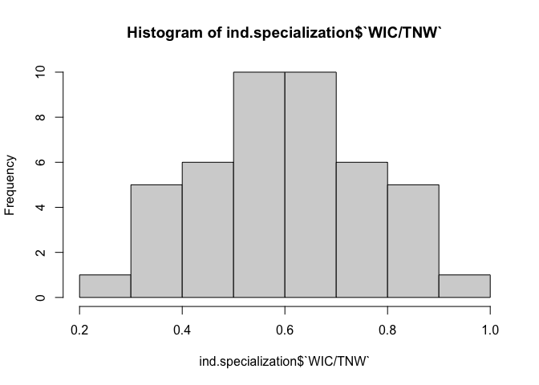
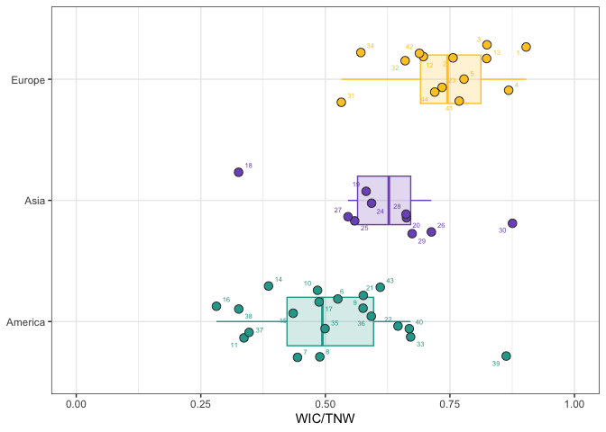
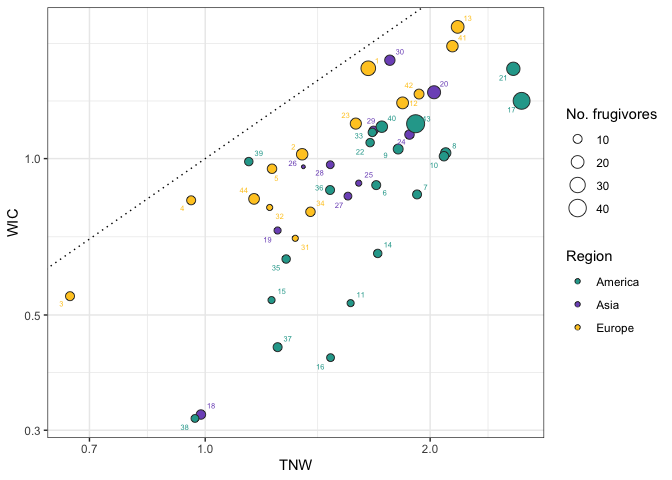
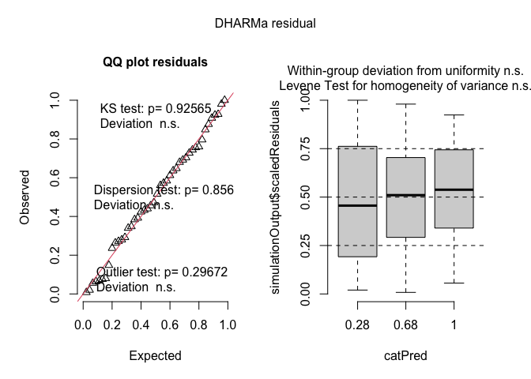

Estimate individual resource specialisation
================
Francisco Rodriguez-Sánchez & Elena Quintero
2024-02-07

``` r
library(here)
library(tidyverse)
library(magrittr)
library(reshape2)
library(ggrepel)
library(patchwork)

theme_set(theme_bw())
```

Idea based on: *Bolnick, D. I., Svanbäck, R., Fordyce, J. A., Yang, L.
H., Davis, J. M., Hulsey, C. D., & Forister, M. L. (2003). The Ecology
of Individuals: Incidence and Implications of Individual Specialization.
The American Naturalist, 106(1), 1–28.*

Roughgarden (1972) suggested that the total niche width of a population
(TNW) can be broken down into two components: the variation in resource
use within individuals (within-individual component, WIC), and the
variance between individuals (between-individual component, BIC) so that
TNW = WIC + BIC (*Bolnick et al. 2002 Ecology*)

Test intra-individual variation in relation to total niche width. See if
INTRA-individual variation is higher than INTRA-individual variation as
seen in several previous studies.

Load networks:

``` r
nets_names <- list.files(path = here("networks/standardized/"), pattern = "_int")

nets <- list()

for (i in 1:length(nets_names)){
  net_file <- paste0("networks/standardized/", nets_names[[i]])
  net <- read.csv(here(net_file))
  
  if(ncol(net)<2){
    net <- read.csv(here(net_file), sep = ";") 
  } else
  {}  

  net %<>% column_to_rownames("ind")
  nets[[i]] <- net
  names(nets)[i] <- nets_names[[i]]
}
```

## Shannon index approximation to WIC/TNW.

Original Roughgarden’s WIC/TNW was limited to continuous diet data. But
Roughgarden (1979:510) proposes a measure that uses the Shannon-Weaver
index as a proxy for variance.

``` r
source(here("functions/functions_shannon.R"))
```

Loop for all our nets:

``` r
ind.specialization <- data.frame()

for(i in 1:length(nets)){
  net_id = names(nets[i]) %>% str_sub(3, 7)

  net <- nets[[i]]

  wic_net = wic(net)
  tnw_net = tnw(net)
  ratio = wic(net) / tnw(net)
  names(ratio) <- "WIC/TNW"

  tmp <- cbind(net_id = net_id,
               wic_net,
               tnw_net,
               ratio)

  ind.specialization <- rbind(ind.specialization, tmp)
}

glimpse(ind.specialization)

ind.specialization %<>% rename(WIC = wic)
write_csv(ind.specialization, here("data/WIC_TNW.csv"))

#ind.specialization <- read.csv(here("data/WIC_TNW.csv"))
```

Add network info:

``` r
net_cols <- read_csv(here("data/net_colors.csv"))

cols.plants <- as.character(net_cols$cols_continent3)
names(cols.plants) <- as.character(net_cols$plant_sp)

cols.cont <- as.character(net_cols$cols_continent4)
names(cols.cont) <- as.character(net_cols$continent)

plot_cols <- net_cols %>% dplyr::select(plant_sp, continent, plant_plot_rank)

ind_nets_ID <- read.csv(here("data/net.level.selection.csv")) %>%
  filter(type == "ind") %>%
  left_join(plot_cols)

ind.specialization %<>% 
  left_join(ind_nets_ID) %>%
  filter(!net_id %in% c("08_01", "12_01", "12_06", "12_07")) # remove small incomplete nets
```

Distribution of WIC/TNW:

``` r
hist(ind.specialization$`WIC/TNW`)
```

<!-- -->

``` r
summary(ind.specialization$`WIC/TNW`)
```

    ##    Min. 1st Qu.  Median    Mean 3rd Qu.    Max. 
    ##  0.2813  0.4967  0.6016  0.6082  0.7145  0.9030

boxplot of WIC/TNW Shannon:

``` r
pos <- position_jitter(height = 0.3, seed = 2)

ggplot(ind.specialization, aes(y = continent, x = `WIC/TNW`, 
                     color = continent, fill = continent)) +
  geom_boxplot(alpha = .2, outlier.shape = NA, width = 0.4) + 
  geom_jitter(size = 3, position = pos, shape = 21, color = "grey20") + 
  ggrepel::geom_text_repel(aes(label = net_n),
                           size = 2, position = pos) +
  scale_color_manual(values = cols.cont) +
  scale_fill_manual(values = cols.cont) +
  scale_x_continuous(limits = c(0,1)) +
  theme(legend.position = "none",
        panel.border = element_rect(linewidth = 0.5, fill = NA)) +
  labs(x = "WIC/TNW", y  = NULL)  
```

<!-- -->

``` r
ggsave(here("figs/WIC_TNW.pdf"), width = 6, height = 3)
```

Correlate WIC with TNW:

``` r
ggplot(ind.specialization, aes(x = TNW, y = WIC, 
                     color = continent, fill = continent, 
                     size = number.of.species.HL)) +
  geom_point(shape = 21, color = "grey20") + #size = 3
  ggrepel::geom_text_repel(aes(label = net_n), size = 2)+ 
  scale_color_manual(values = cols.cont) +
  scale_fill_manual(values = cols.cont) +
  theme(#legend.position = "none",
        panel.border = element_rect(linewidth = 0.5, fill = NA)) + 
  geom_abline(slope = 1, linetype = 3) +
  #geom_abline(slope = 0.5, linetype = 3) +
  #scale_x_continuous(limits = c(0,3)) + scale_y_continuous(limits = c(0,2)) +
  scale_y_log10() + scale_x_log10() +
  labs(y = "WIC", x  = "TNW", size = "No. frugivores", color = "Region", fill = "Region") 
```

<!-- -->

``` r
ggsave(here("figs/WIC_vs_TNW_log.pdf"), width = 7, height = 5)
```

Test to determine differences among geographic regions:

``` r
library(lme4)

hist(ind.specialization$`WIC/TNW`)
```

<!-- -->

``` r
m1<- glmmTMB::glmmTMB(`WIC/TNW` ~ continent + (1|study), data = ind.specialization)
summary(m1)
```

    ##  Family: gaussian  ( identity )
    ## Formula:          `WIC/TNW` ~ continent + (1 | study)
    ## Data: ind.specialization
    ## 
    ##      AIC      BIC   logLik deviance df.resid 
    ##    -46.7    -37.8     28.3    -56.7       39 
    ## 
    ## Random effects:
    ## 
    ## Conditional model:
    ##  Groups   Name        Variance  Std.Dev. 
    ##  study    (Intercept) 2.287e-10 1.512e-05
    ##  Residual             1.615e-02 1.271e-01
    ## Number of obs: 44, groups:  study, 20
    ## 
    ## Dispersion estimate for gaussian family (sigma^2): 0.0161 
    ## 
    ## Conditional model:
    ##                 Estimate Std. Error z value Pr(>|z|)    
    ## (Intercept)      0.51218    0.02841  18.027  < 2e-16 ***
    ## continentAsia    0.10704    0.04921   2.175   0.0296 *  
    ## continentEurope  0.22530    0.04428   5.088 3.61e-07 ***
    ## ---
    ## Signif. codes:  0 '***' 0.001 '**' 0.01 '*' 0.05 '.' 0.1 ' ' 1

``` r
DHARMa::simulateResiduals(m1, plot =T)
```

<!-- -->

    ## Object of Class DHARMa with simulated residuals based on 250 simulations with refit = FALSE . See ?DHARMa::simulateResiduals for help. 
    ##  
    ## Scaled residual values: 0.924 0.56 0.744 0.848 0.612 0.584 0.236 0.472 0.68 0.424 0.068 0.392 0.76 0.148 0.264 0.02 0.44 0.008 0.384 0.636 ...

``` r
library(modelbased)
estimate_contrasts(m1, contrast = "continent")
```

    ## Marginal Contrasts Analysis
    ## 
    ## Level1  |  Level2 | Difference |        95% CI |   SE | t(39) |      p
    ## ----------------------------------------------------------------------
    ## America |    Asia |      -0.11 | [-0.23, 0.02] | 0.05 | -2.18 | 0.088 
    ## Europe  | America |       0.23 | [ 0.11, 0.34] | 0.04 |  5.09 | < .001
    ## Europe  |    Asia |       0.12 | [-0.01, 0.25] | 0.05 |  2.25 | 0.076 
    ## 
    ## Marginal contrasts estimated at continent
    ## p-value adjustment method: Holm (1979)
