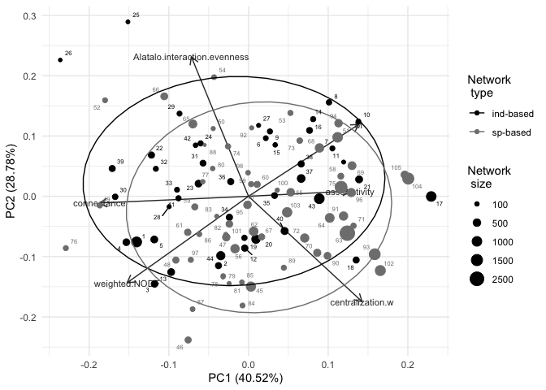

Network-level differences in networks
================
Elena Quintero
2024-02-07

``` r
library(here)
library(tidyverse)
library(magrittr)
library(rcartocolor)
library(patchwork)
library(ggalt)
library(psych)
library(ggfortify)
library(ggrepel)
library(knitr)
library(kableExtra)
library(cluster)
library(GGally)
library(reshape2)
library(ggcorrplot)
library(gridExtra)
theme_set(theme_minimal())
```

Load net-level metrics:

``` r
net.level <- read.csv(here("data/net.level.selection.csv")) %>%
  mutate(WC.new  = exp(Shannon.diversity)/net_size) %>%
  mutate(type = recode(type, "ind"="ind-based", "sp"="sp-based"))

glimpse(net.level)
```

    ## Rows: 105
    ## Columns: 51
    ## $ connectance                     <dbl> 0.3629630, 0.2093750, 0.3914286, 0.4…
    ## $ web.asymmetry                   <dbl> -0.19402985, -0.42857143, -0.5555555…
    ## $ links.per.species               <dbl> 5.850746, 2.392857, 3.044444, 3.4222…
    ## $ cluster.coefficient             <dbl> 0.22500000, 0.06250000, 0.25714286, …
    ## $ NODF                            <dbl> 67.21158, 63.51606, 72.48350, 71.689…
    ## $ weighted.NODF                   <dbl> 52.79227, 43.93032, 37.73835, 38.511…
    ## $ M                               <dbl> 0.15799305, 0.23921401, 0.09040128, …
    ## $ interaction.strength.asymmetry  <dbl> 0.098096343, 0.303002612, 1.19449172…
    ## $ specialisation.asymmetry        <dbl> 1.00000000, -0.48846320, -0.82692306…
    ## $ linkage.density                 <dbl> 16.046511, 9.152386, 10.990321, 13.9…
    ## $ weighted.connectance            <dbl> 0.2395002, 0.1634355, 0.2442293, 0.3…
    ## $ Shannon.diversity               <dbl> 4.933505, 3.959126, 3.653736, 4.1713…
    ## $ interaction.evenness            <dbl> 0.7063286, 0.6127286, 0.6237244, 0.7…
    ## $ Alatalo.interaction.evenness    <dbl> 0.6550250, 0.5924512, 0.5490386, 0.6…
    ## $ H2                              <dbl> 0.09933567, 0.24470407, 0.17791608, …
    ## $ number.of.species.HL            <int> 27, 16, 10, 10, 11, 10, 10, 13, 12, …
    ## $ number.of.species.LL            <int> 40, 40, 35, 35, 35, 13, 14, 14, 13, …
    ## $ cluster.coefficient.HL          <dbl> 0.9360087, 0.7633714, 0.9610723, 0.9…
    ## $ cluster.coefficient.LL          <dbl> 0.4297705, 0.2429504, 0.3870170, 0.4…
    ## $ weighted.cluster.coefficient.HL <dbl> 1.00000000, 0.75836703, 0.82419380, …
    ## $ weighted.cluster.coefficient.LL <dbl> 0.9675836, 0.8203872, 0.9500581, 0.9…
    ## $ niche.overlap.horn.HL           <dbl> 0.28227633, 0.09229992, 0.14771050, …
    ## $ niche.overlap.horn.LL           <dbl> 0.8377570, 0.6984493, 0.9032446, 0.9…
    ## $ extinction.slope.HL             <dbl> 10.730740, 3.721760, 4.293068, 5.561…
    ## $ extinction.slope.LL             <dbl> 7.822940, 2.596134, 5.649524, 6.7967…
    ## $ robustness.HL                   <dbl> 0.9145234, 0.7824115, 0.8078489, 0.8…
    ## $ robustness.LL                   <dbl> 0.8599260, 0.7138990, 0.8181298, 0.8…
    ## $ generality.HL                   <dbl> 27.560125, 15.435135, 20.212817, 25.…
    ## $ vulnerability.LL                <dbl> 4.532896, 2.869637, 1.767824, 2.3798…
    ## $ niche.overlap.bray.HL           <dbl> 0.09729529, 0.03883194, 0.07298345, …
    ## $ niche.overlap.bray.LL           <dbl> 0.5567506, 0.3390878, 0.4458126, 0.5…
    ## $ niche.overlap.jaccard.HL        <dbl> 0.05728874, 0.02443975, 0.04183463, …
    ## $ niche.overlap.jaccard.LL        <dbl> 0.40377235, 0.22904359, 0.31947895, …
    ## $ net_size                        <int> 1080, 640, 350, 350, 385, 130, 140, …
    ## $ net_id                          <chr> "01_01", "01_02", "02_01", "02_02", …
    ## $ links                           <dbl> 1, 1, 1, 1, 1, 1, 1, 1, 1, 1, 1, 1, …
    ## $ net_n                           <int> 1, 2, 3, 4, 5, 6, 7, 8, 9, 10, 11, 1…
    ## $ type                            <chr> "ind-based", "ind-based", "ind-based…
    ## $ net_code                        <chr> "ind_01_01", "ind_01_02", "ind_02_01…
    ## $ assortativity                   <dbl> -0.5071021, -0.6033629, -0.7374228, …
    ## $ centr_binary                    <dbl> 0.6210147, 0.7887529, 0.7122378, 0.6…
    ## $ centralization.w                <dbl> 0.8549594, 0.9221565, 0.9284492, 0.8…
    ## $ unique.ints                     <dbl> 392, 134, 137, 154, 148, 37, 33, 46,…
    ## $ code_ID                         <chr> "01_01", "01_02", "02_01", "02_02", …
    ## $ ref                             <chr> "Quintero et al 2023 Ecology letters…
    ## $ bioregion                       <lgl> NA, NA, NA, NA, NA, NA, NA, NA, NA, …
    ## $ country                         <chr> "Spain", "Spain", "Spain", "Spain", …
    ## $ plant_sp                        <chr> "Pistacia lentiscus", "Pistacia lent…
    ## $ n_nodes                         <int> 67, 56, 45, 45, 46, 23, 24, 27, 25, …
    ## $ study                           <chr> "ind_01", "ind_01", "ind_02", "ind_0…
    ## $ WC.new                          <dbl> 0.12857902, 0.08189298, 0.11033908, …

Select only metrics of interest:

``` r
metrics.of.interest.size <- c("connectance", 
                         "weighted.NODF", 
                         "M", 
                         "Alatalo.interaction.evenness",
                         "centralization.w",
                         "assortativity",
                         "net_size")

#Remove net_size
metrics.of.interest <- metrics.of.interest.size[metrics.of.interest.size != "net_size"]
```

## PCA for network level metrics

``` r
pc <- prcomp(net.level[, metrics.of.interest],
             center = TRUE,
             scale. = TRUE)

summary(pc)
```

    ## Importance of components:
    ##                           PC1    PC2    PC3    PC4     PC5     PC6
    ## Standard deviation     1.5592 1.3141 0.9084 0.7422 0.53584 0.42316
    ## Proportion of Variance 0.4052 0.2878 0.1375 0.0918 0.04785 0.02984
    ## Cumulative Proportion  0.4052 0.6930 0.8305 0.9223 0.97016 1.00000

``` r
print(pc)
```

    ## Standard deviations (1, .., p=6):
    ## [1] 1.5591754 1.3140735 0.9084009 0.7421581 0.5358439 0.4231587
    ## 
    ## Rotation (n x k) = (6 x 6):
    ##                                     PC1         PC2         PC3         PC4
    ## connectance                  -0.5420149 -0.03226014  0.09701097 -0.56402585
    ## weighted.NODF                -0.4415650 -0.41552623 -0.22694255 -0.26757023
    ## M                             0.4007124  0.34542113  0.36244773 -0.69444066
    ## Alatalo.interaction.evenness -0.2080943  0.67093680 -0.10238893  0.18708830
    ## centralization.w              0.4130728 -0.50615296  0.24908298  0.01452903
    ## assortativity                 0.3697801  0.02518856 -0.85743324 -0.30466384
    ##                                      PC5         PC6
    ## connectance                   0.55597735 -0.26178615
    ## weighted.NODF                -0.71161806 -0.05349071
    ## M                            -0.31200922  0.09564436
    ## Alatalo.interaction.evenness -0.25297511 -0.63012590
    ## centralization.w              0.00806408 -0.71474584
    ## assortativity                 0.15191358 -0.10741808

``` r
pc.importance <- summary(pc)$importance %>% 
  as.data.frame() %>% 
  mutate_if(is.numeric, ~sprintf("%.2f",.))

loadings <- pc$rotation %>% 
  as.data.frame() %>% 
  mutate_if(is.numeric, ~sprintf("%.2f",.))

# write.csv(pc.importance, here("tables/PCA_nets_pc_importance.csv"))
# write.csv(loadings, here("tables/PCA_nets_loadings.csv"))

autoplot(pc,
         data = net.level,
         loadings = TRUE,
         loadings.level = TRUE,
         #frame.type = "norm",
         loadings.label = TRUE, 
         loadings.label.size = 3,
         loadings.colour = "grey20",
         loadings.label.colour = "grey20",
         color = NA) +
  geom_point(aes(size = net_size, color = type)) +
  stat_ellipse(aes(color = type), type = "norm", level = 0.80) + 
  geom_text_repel(aes(label = net_n, color = type), size = 2) +
  #scale_color_carto_d() +
  scale_color_manual(values = c("black", "grey50")) +
  scale_size_continuous(breaks = c(100, 500, 1000, 1500, 2500)) + 
  labs(size = "Network \n size", color = "Network \n type")
```

<!-- -->

``` r
ggsave(here("figs/PCA_sp-sp_vs_ind-sp.pdf"), width = 7, height = 5)
```
