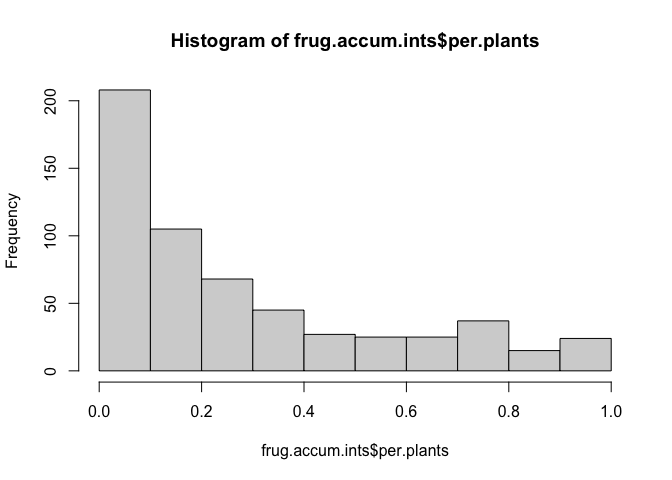

Calculate frugivores’ contribution
================
Elena Quintero
2024-02-07

``` r
library(here)
library(tidyverse)
library(magrittr)
library(reshape2)
library(ggrepel)
library(patchwork)

theme_set(theme_minimal())
```

## FRUGIVORES (aggregate data by frugivores)

Load datasets:

``` r
frug.ints <- read.csv(here("data/frugivores_interactions.csv"))

ind.level.df <- read.csv(here("data/node.level.selection.csv"))

#Net colors:
mycols <- as.character(ind.level.df$cols_continent3)
names(mycols) <- as.character(ind.level.df$plant_sp)

mycols.cont <- as.character(ind.level.df$cols_continent4)
names(mycols.cont) <- as.character(ind.level.df$continent)
```

Accumulated consumption by frugivores in the net:

``` r
frug.accum.ints <- frug.ints %>% 
  group_by(net_id) %>% 
  mutate(total.ints = sum(ints),
         rank = rank(desc(ints))) %>%
  arrange(net_id, rank) %>%
  mutate(order = order(rank),
         acc_ints = cumsum(ints)) %>% #accumulation in increasing order
  arrange(net_id, desc(order)) %>%
  mutate(inverse_acc_ints = cumsum(ints)) %>% #accumulation in decreasing order
  mutate(core50 = ifelse(inverse_acc_ints > 0.5, "yes", "no"))

glimpse(frug.accum.ints)
```

    ## Rows: 579
    ## Columns: 24
    ## Groups: net_id [48]
    ## $ net_id           <chr> "01_01", "01_01", "01_01", "01_01", "01_01", "01_01…
    ## $ frug_sp          <chr> "Coccothraustes_coccothraustes", "Turdus_viscivorus…
    ## $ ints             <dbl> 2.906698e-06, 1.740368e-05, 2.913562e-05, 5.231245e…
    ## $ n_ind            <int> 40, 40, 40, 40, 40, 40, 40, 40, 40, 40, 40, 40, 40,…
    ## $ n_plants_int     <int> 1, 1, 2, 3, 4, 2, 6, 5, 7, 1, 6, 9, 10, 10, 17, 15,…
    ## $ per.plants       <dbl> 0.025, 0.025, 0.050, 0.075, 0.100, 0.050, 0.150, 0.…
    ## $ plant_sp         <chr> "Pistacia lentiscus", "Pistacia lentiscus", "Pistac…
    ## $ pop              <chr> "El Puntal", "El Puntal", "El Puntal", "El Puntal",…
    ## $ country          <chr> "Spain", "Spain", "Spain", "Spain", "Spain", "Spain…
    ## $ net_name         <chr> "Pistacia lentiscus_El Puntal", "Pistacia lentiscus…
    ## $ continent        <chr> "Europe", "Europe", "Europe", "Europe", "Europe", "…
    ## $ plant_plot_rank  <int> 27, 27, 27, 27, 27, 27, 27, 27, 27, 27, 27, 27, 27,…
    ## $ frug_sp_original <chr> "Coccothraustes coccothraustes", "Turdus viscivorus…
    ## $ frug_sp_elton    <chr> "Coccothraustes coccothraustes", "Turdus viscivorus…
    ## $ family           <chr> "Fringillidae", "Turdidae", "Muscicapidae", "Sylvii…
    ## $ bmass.elton      <dbl> 56.63, 117.37, 15.90, 9.60, 11.00, 24.26, 13.30, 18…
    ## $ class            <chr> "bird", "bird", "bird", "bird", "bird", "bird", "bi…
    ## $ bmass            <dbl> 56.63, 117.37, 15.90, 9.60, 11.00, 24.26, 13.30, 18…
    ## $ total.ints       <dbl> 1, 1, 1, 1, 1, 1, 1, 1, 1, 1, 1, 1, 1, 1, 1, 1, 1, …
    ## $ rank             <dbl> 27, 26, 25, 24, 23, 22, 21, 20, 19, 18, 17, 16, 15,…
    ## $ order            <int> 27, 26, 25, 24, 23, 22, 21, 20, 19, 18, 17, 16, 15,…
    ## $ acc_ints         <dbl> 1.0000000, 0.9999971, 0.9999797, 0.9999506, 0.99989…
    ## $ inverse_acc_ints <dbl> 2.906698e-06, 2.031038e-05, 4.944601e-05, 1.017585e…
    ## $ core50           <chr> "no", "no", "no", "no", "no", "no", "no", "no", "no…

How many frugivores in the net represent \>50% of consumption?

``` r
d1 <- frug.accum.ints %>%
  group_by(net_id, core50) %>%
  summarise(n=n()) %>%
  pivot_wider(names_from = "core50", values_from = "n") %>%
  mutate(per.core.frug = yes/(yes+no))

summary(d1$per.core.frug)
```

    ##    Min. 1st Qu.  Median    Mean 3rd Qu.    Max. 
    ## 0.02326 0.11036 0.17424 0.18691 0.23558 0.50000

``` r
sd(d1$per.core.frug)
```

    ## [1] 0.09584839

``` r
hist(d1$per.core.frug)
```

<!-- -->

De media menos del 20% (18.6%) de los frugivores realizan más de la
mitad de las interacciones/visitas (rango: min = 2% - 50%)

Calculate bodymass value relative to each network (study site):

``` r
frug.accum.ints %<>% group_by(net_id) %>%
  mutate(bmass.scaled = scale(bmass))

hist(frug.accum.ints$bmass.scaled)
```

<!-- -->

Plot accumulation of interactions:

``` r
frug.accum.ints %>%
  filter(!net_id %in% c("08_01", "12_01", "12_06", "12_07")) %>%
  ggplot(aes(x = order, y = ints, group = net_id)) + 
  geom_line(color = "grey70") +
  geom_point(aes(fill = plant_sp, color = core50, size = bmass.scaled), pch = 21) +
  scale_fill_manual(values = mycols) +
  scale_color_manual(values = c("white", "black")) +
  facet_wrap(~fct_reorder(plant_sp, plant_plot_rank), scales = "free", ncol = 4) +
  theme(legend.position = "none", axis.text.x = element_blank(),
        strip.text = element_text(face = "italic"), 
        panel.border = element_rect(linewidth = 0.2, fill = NA),
        panel.grid.minor.y = element_blank(),
        panel.grid.major.x = element_blank(),
        panel.grid.minor.x = element_blank()) +
  labs(x = "Frugivore species ranked by contribution", y = "Contribution to total interactions")
```

<!-- -->

``` r
  #caption = "Black contour represent frugivore species that aggregated perform >50% of interactions"

ggsave(here("figs/frugivore_ints_accumulated.pdf"), width = 8, height = 9)
```

Plot for all frugivores in the net the % of interactions it held vs. %
of plants it interacted with.

``` r
frug.accum.ints %>% 
  filter(!net_id %in% c("08_01", "12_01", "12_06", "12_07")) %>%
  ggplot(aes(x = ints, y = per.plants, 
             color = continent,
             label = frug_sp, label2 = net_id)) + 
  geom_point(aes(size = bmass.scaled), alpha = 0.6) +
  scale_color_manual(values = mycols.cont) +
  scale_size_continuous(breaks = c(-1, 0, 1.5, 3, 5)) +
  theme(panel.border = element_rect(fill = NA, linewidth = 0.5)) +
  labs(y = "Proportion of plants in the network visited by each frugivore", 
       x = "Frugivore's contribution to the overall interactions in the network", 
       color = "Region", size = "Body mass \nz-score") 
```

<!-- -->

``` r
ggsave(here("figs/interaction_distribution_frugs.pdf"), height = 5, width = 7)
```

Model to test relationship:

``` r
hist(frug.accum.ints$ints)
```

<!-- -->

``` r
hist(frug.accum.ints$per.plants)
```

<!-- -->

``` r
hist(log(frug.accum.ints$ints))
```

<!-- -->

``` r
hist(log(frug.accum.ints$per.plants))
```

<!-- -->

``` r
plot(log(frug.accum.ints$ints), log(frug.accum.ints$per.plants))
```

<!-- -->

``` r
data.model <- frug.accum.ints %>% 
  filter(!net_id %in% c("08_01", "12_01", "12_06", "12_07")) %>%
  mutate(net_id = as.factor(net_id)) 

#simple correlations
cor.test(data.model$ints, data.model$per.plants, method = "spearman")
```

    ## 
    ##  Spearman's rank correlation rho
    ## 
    ## data:  data.model$ints and data.model$per.plants
    ## S = 5622328, p-value < 2.2e-16
    ## alternative hypothesis: true rho is not equal to 0
    ## sample estimates:
    ##     rho 
    ## 0.80791

``` r
cor.test(data.model$ints, data.model$bmass.scaled, method = "spearman")
```

    ## 
    ##  Spearman's rank correlation rho
    ## 
    ## data:  data.model$ints and data.model$bmass.scaled
    ## S = 30606109, p-value = 0.2259
    ## alternative hypothesis: true rho is not equal to 0
    ## sample estimates:
    ##         rho 
    ## -0.05129679

``` r
cor.test(data.model$per.plants, data.model$bmass.scaled, method = "spearman")
```

    ## 
    ##  Spearman's rank correlation rho
    ## 
    ## data:  data.model$per.plants and data.model$bmass.scaled
    ## S = 32170373, p-value = 0.01297
    ## alternative hypothesis: true rho is not equal to 0
    ## sample estimates:
    ##        rho 
    ## -0.1050281
