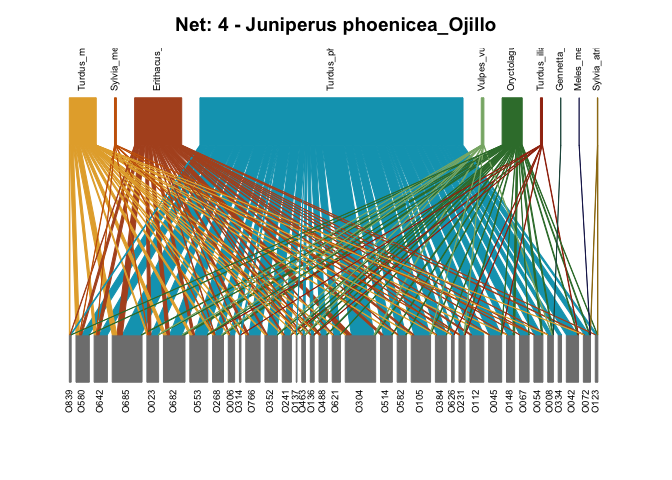
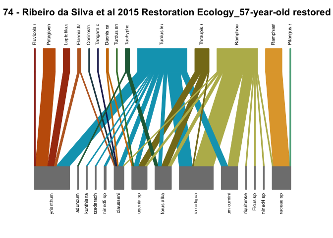

Plot networks
================
Elena Quintero
2024-07-10

``` r
library(here)
library(tidyverse)
library(magrittr)
library(reshape2)
library(bipartite)
library(ggrepel)
library(patchwork)

theme_set(theme_bw())
```

### Read all networks:

``` r
#Read list of names
nets_names <- list.files(path = here("networks/nets_std/"))

#Create empty list
nets <- list()

#Add all read files to the list
for (i in 1:length(nets_names)) {
  
  net_file <- paste0("networks/nets_std/", nets_names[[i]])
  net <- read.csv(here(net_file))
  
  if (str_detect(nets_names[i], "sp_")) {
    net %<>% column_to_rownames("sp")
  } else
  {
    net %<>% column_to_rownames("ind")
    }  

  nets[[i]] <- net #add to list
  names(nets)[i] <- nets_names[[i]] #name the list
  
}
```

### Read nets characteristics

(name, site etc…)

``` r
nets_char_ind <- readxl::read_xlsx(here("data/selected_individual_networks.xlsx"))

nets_ID_ind <- nets_char_ind %>%
  select(net_id = code_ID,
         ref,
         plant_sp = `focus species`,
         pop = pop_site) %>%
  filter(! net_id %in%  c("08_01", "12_01", "12_06", "12_07")) %>%
  mutate(type = "ind-based",
         net_name = paste0(plant_sp, "_", pop))

nets_char_sp <- readxl::read_xlsx(here("data/selected_networks.xlsx"))

nets_ID_sp <- nets_char_sp %>% 
  filter (type == "sp") %>%
  select(net_id = code_ID,
         ref, site) %>%
  filter(! net_id %in% c("03_01", "03_02", "03_03", "03_04",
                       "05_01", "09_01", "29_12", "31_01", "44_01")) %>%
  mutate(type = "sp-based",
         net_name = paste0(ref, "_", site))

nets_ID <- full_join(nets_ID_ind, nets_ID_sp) %>%
  group_by(type, net_id) %>%
  mutate(net_n = cur_group_id(),
         net_name = paste0("Net: ", net_n, " - ", net_name))
```

### Plot webs:

``` r
for (i in 1:length(nets)){
  
  if (str_detect(names(nets)[i], "sp_")) {
    this_net <- str_sub(names(nets)[i], 4, 8)
    net_info <- nets_ID %>% 
      filter(type == "sp-based", net_id == this_net)
  }
  else{
    this_net <- str_sub(names(nets)[i], 1, 5)
    net_info <- nets_ID %>% 
      filter(type == "ind-based", net_id == this_net)
  }
  
  col.animals = MetBrewer::met.brewer("Lakota", length(nets[[i]]))
  
  plotweb(nets[[i]],
        col.high = col.animals, bor.col.high = col.animals,
        col.low = "grey50", bor.col.low = "grey50",
        col.interaction = col.animals, 
        bor.col.interaction = col.animals,
        text.rot = 90)
  
  title(main = net_info$net_name)
}
```

<!-- --><!-- --><!-- --><!-- --><!-- --><!-- --><!-- --><!-- --><!-- --><!-- --><!-- --><!-- --><!-- --><!-- --><!-- --><!-- --><!-- --><!-- --><!-- --><!-- --><!-- --><!-- --><!-- --><!-- --><!-- --><!-- --><!-- --><!-- --><!-- --><!-- --><!-- --><!-- --><!-- --><!-- --><!-- --><!-- --><!-- --><!-- --><!-- --><!-- --><!-- --><!-- --><!-- --><!-- --><!-- --><!-- --><!-- --><!-- --><!-- --><!-- --><!-- --><!-- --><!-- --><!-- --><!-- --><!-- --><!-- --><!-- --><!-- --><!-- --><!-- --><!-- --><!-- --><!-- --><!-- --><!-- --><!-- --><!-- --><!-- --><!-- --><!-- --><!-- --><!-- --><!-- --><!-- --><!-- --><!-- --><!-- --><!-- --><!-- --><!-- --><!-- --><!-- --><!-- --><!-- --><!-- --><!-- --><!-- --><!-- --><!-- --><!-- --><!-- --><!-- --><!-- --><!-- --><!-- --><!-- --><!-- --><!-- --><!-- --><!-- --><!-- --><!-- --><!-- --><!-- -->
