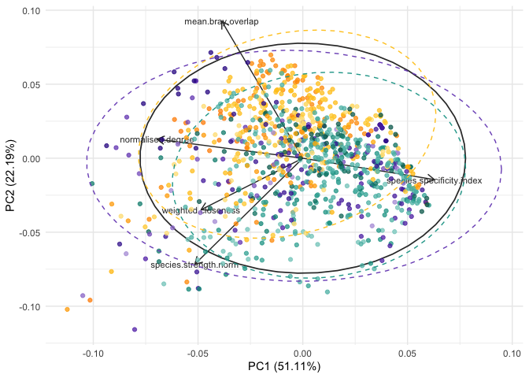
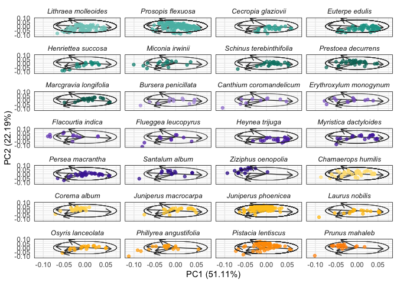
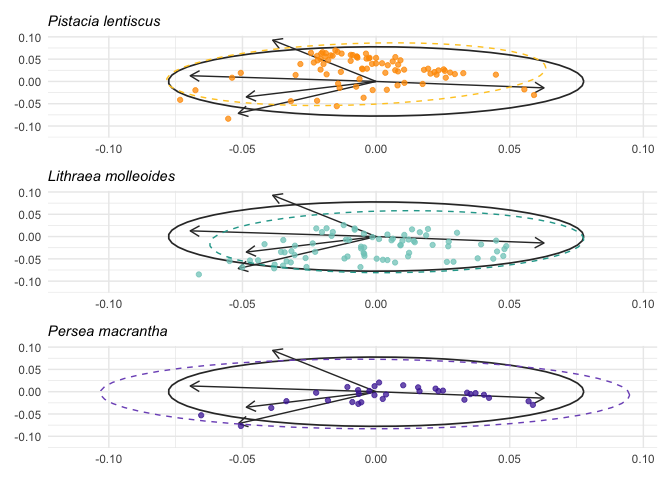
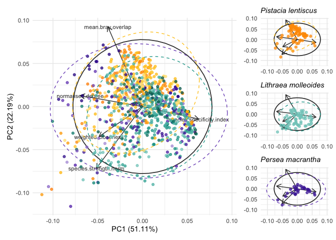
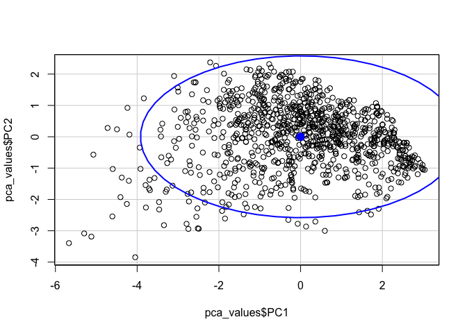
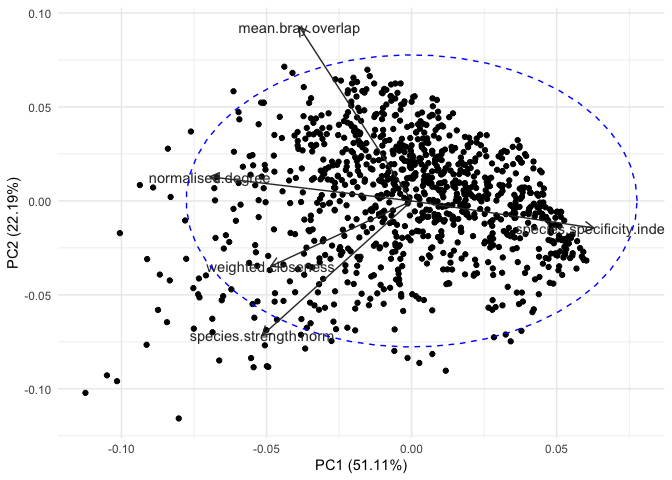
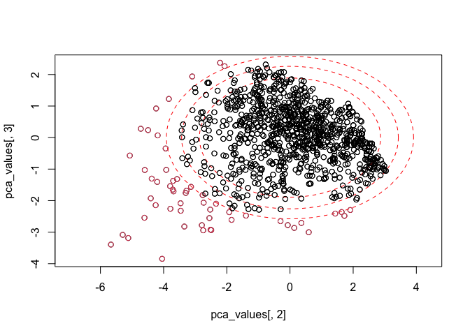
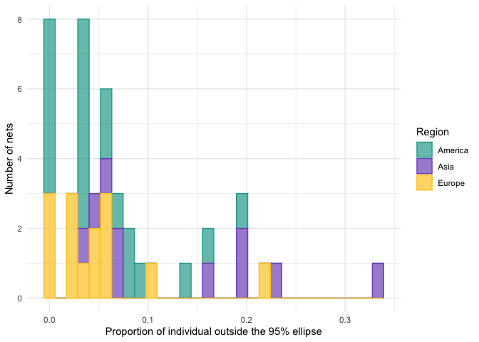

Node-level analysis
================
Elena Quintero
2024-02-07

``` r
library(here)
library(tidyverse)
library(tidylog)
library(magrittr)
library(rcartocolor)
library(patchwork)
library(ggalt)
library(psych)
library(ggfortify)
library(ggrepel)
library(gridExtra)
library(ggnewscale)
theme_set(theme_minimal())
```

### INDIVIDUAL-NODE LEVEL:

``` r
ind.level.df <- read.csv(here("data/node.level.selection.csv"))

#Normalization function:
min_max_norm <- function(x){(x-min(x))/(max(x)-min(x))}

ind.level.df %<>% 
  group_by(net_id) %>% 
  mutate(species.strength.norm = min_max_norm(species.strength)) #normalize species
```

Load net colors:

``` r
net_cols <- read_csv(here("data/net_colors.csv"))

mycols <- as.character(net_cols$cols_continent3)
names(mycols) <- as.character(net_cols$plant_sp)

col.cont <- as.character(net_cols$cols_continent4)
names(col.cont) <- as.character(net_cols$continent)
```

# SELECT NETWORK METRICS

``` r
metrics.pca <- c("normalised.degree", 
                 "species.strength.norm",
                 "species.specificity.index",
                 "weighted.closeness",
                 "mean.bray.overlap" 
                 )
```

``` r
pc_ind <- prcomp(ind.level.df[, metrics.pca],
              center = TRUE,
              scale. = TRUE)

summary(pc_ind)
```

    ## Importance of components:
    ##                           PC1    PC2    PC3    PC4    PC5
    ## Standard deviation     1.5986 1.0533 0.8357 0.6360 0.4816
    ## Proportion of Variance 0.5111 0.2219 0.1397 0.0809 0.0464
    ## Cumulative Proportion  0.5111 0.7330 0.8727 0.9536 1.0000

``` r
print(pc_ind)
```

    ## Standard deviations (1, .., p=5):
    ## [1] 1.5986268 1.0533165 0.8357359 0.6359883 0.4816439
    ## 
    ## Rotation (n x k) = (5 x 5):
    ##                                  PC1        PC2        PC3        PC4
    ## normalised.degree         -0.5623856  0.1037636 -0.1851769 -0.2107914
    ## species.strength.norm     -0.4167518 -0.5792946 -0.2327395 -0.5090900
    ## species.specificity.index  0.5080267 -0.1167135  0.3917285 -0.7010438
    ## weighted.closeness        -0.3925657 -0.2814196  0.8416542  0.2406943
    ## mean.bray.overlap         -0.3127962  0.7488871  0.2229547 -0.3834034
    ##                                  PC5
    ## normalised.degree          0.7708645
    ## species.strength.norm     -0.4211833
    ## species.specificity.index  0.2887441
    ## weighted.closeness         0.0194833
    ## mean.bray.overlap         -0.3802891

``` r
# # plot PCA:
pca.plot <- autoplot(pc_ind,
         data = ind.level.df,
         loadings = TRUE,
         loadings.level = TRUE,
         loadings.label = TRUE, 
         loadings.label.size = 3, 
         loadings.colour = "grey20",
         loadings.label.colour = "grey20",
         color ="white") +
  stat_ellipse(type = "norm", color = "grey20", level = 0.95, linewidth = 0.6) + 
  geom_point(aes(color = plant_sp), alpha = 0.75) +
  scale_color_manual(values = mycols) + 
  new_scale_color()+
  stat_ellipse(aes(color = continent), type = "norm", linetype = "dashed", level = 0.95) +
  scale_color_manual(values = col.cont) +
  theme(legend.position = "none")

pca.plot
```

<!-- -->

``` r
ggsave(here("figs/PCA_inds_norm.pdf"), width = 7, height = 6)
```

plot PCA separated by plant spp:

``` r
autoplot(pc_ind,
         data = ind.level.df,
         loadings = TRUE,
         loadings.level = TRUE,
         loadings.label = FALSE,
         loadings.colour = "grey20",
         color = "white") +
  geom_point(aes(color = plant_sp), alpha = 0.75) +
  scale_color_manual(values = mycols) +
  theme(legend.position = "none",
        panel.border = element_rect(fill = NA, linewidth = 0.5),
        strip.text = element_text(face = "italic")) +
  facet_wrap(~fct_reorder(plant_sp, plant_plot_rank), ncol = 4) + 
  ggforce::geom_ellipse(aes(x0 = 0, y0 = 0, a = 0.076, b = 0.076, angle = 0), 
                        size = 0.05, color = "grey20")
```

<!-- -->

``` r
ggsave(here("figs/PCA_nodes_species.pdf"), width = 7, height = 9)
```

Example with 3 plant species:

``` r
pca.plot.empty <-
autoplot(pc_ind,
         data = ind.level.df,
         loadings = TRUE,
         loadings.level = TRUE,
         loadings.label = FALSE, 
         loadings.colour = "grey20",
         color = NA) +
  stat_ellipse(type = "norm", color = "grey20", level = 0.95, linewidth = 0.6) + 
  theme(legend.position = "none") 


#*Pistacia lentiscus* plot:
col_pl <- ind.level.df %>% 
  mutate(cols_selec = ifelse(plant_sp == "Pistacia lentiscus", cols_continent3, "NA"),
         cols_selec2 = ifelse(continent == "Europe", cols_continent4, "NA"))

col.pl <- as.character(col_pl$cols_selec)
names(col.pl) <- as.character(col_pl$plant_sp)
col.eu <- as.character(col_pl$cols_selec2)
names(col.eu) <- as.character(col_pl$continent)

PL <- pca.plot.empty + 
  geom_point(aes(color = plant_sp), alpha = 0.75) +
  scale_color_manual(values = col.pl) + 
  new_scale_color()+
  stat_ellipse(aes(color = continent), type = "norm", linetype = "dashed", level = 0.95) +
  scale_color_manual(values = col.eu) + 
  theme(title = element_text(hjust = 1, face = "italic")) +
  labs(subtitle = "Pistacia lentiscus", x = NULL, y  = NULL)
# ggsave(here("figs/PCA_nodes/PCA_nodes_norm_PL.pdf"), width = 7, height = 5)

#*Lithraea molleoides* plot:
col_lm <- ind.level.df %>% 
  mutate(cols_selec = ifelse(plant_sp == "Lithraea molleoides", cols_continent3, "NA"),
         cols_selec2 = ifelse(continent == "America", cols_continent4, "NA"))

col.lm <- as.character(col_lm$cols_selec)
names(col.lm) <- as.character(col_lm$plant_sp)
col.am <- as.character(col_lm$cols_selec2)
names(col.am) <- as.character(col_lm$continent)

LM <- pca.plot.empty + 
  geom_point(aes(color = plant_sp), alpha = 0.75) +
  scale_color_manual(values = col.lm) + 
  new_scale_color()+
  stat_ellipse(aes(color = continent), type = "norm", 
               linetype = "dashed", level = 0.95) +
  scale_color_manual(values = col.am) + 
  theme(title = element_text(hjust = 1, face = "italic")) +
  labs(subtitle = "Lithraea molleoides", x = NULL, y  = NULL)

#*Persea macrantha* plot:
col_pm <- ind.level.df %>% 
  mutate(cols_selec = ifelse(plant_sp == "Persea macrantha", cols_continent3, "NA"),
         cols_selec2 = ifelse(continent == "Asia", cols_continent4, "NA"))

col.pm <- as.character(col_pm$cols_selec)
names(col.pm) <- as.character(col_pm$plant_sp)
col.as <- as.character(col_pm$cols_selec2)
names(col.as) <- as.character(col_pm$continent)

PM <- pca.plot.empty + 
  geom_point(aes(color = plant_sp), alpha = 0.75) +
  scale_color_manual(values = col.pm) + 
  new_scale_color()+
  stat_ellipse(aes(color = continent), type = "norm", linetype = "dashed", level = 0.95) +
  scale_color_manual(values = col.as) + 
  theme(title = element_text(hjust = 1, face = "italic")) +
  labs(subtitle = "Persea macrantha", x = NULL, y  = NULL)
#ggsave(here("figs/PCA_nodes/PCA_nodes_norm_PM.pdf"), width = 7, height = 5)

(PL / LM / PM)
```

<!-- -->

FIGURE 4 MS:

``` r
pca.plot + (PL / LM / PM) + 
  plot_layout(widths = c(3, 1))
```

<!-- -->

``` r
ggsave(here("figs/PCA_nodes_no_hist.pdf"), width = 9, height = 6)
```

Calculate point distance to centroid for each study to test.

``` r
pca_values <- pc_ind[["x"]] %>% 
  as.data.frame() %>%
  cbind(ind_ID = ind.level.df$ind_ID) %>%
  relocate(ind_ID, .before = everything()) %>%
  left_join(ind.level.df)

car::dataEllipse(pca_values$PC1, pca_values$PC2, levels=0.95) -> retDat
```

<!-- -->

Ellipse 95% CI:

``` r
autoplot(pc_ind,
         data = ind.level.df,
         loadings = TRUE,
         loadings.label = TRUE,
         loadings.label.colour = "grey20",
         loadings.colour = "grey20") + 
  stat_ellipse(type = "norm", color = "blue", linetype = "dashed", level = 0.95) 
```

<!-- -->

<https://cran.r-project.org/web/packages/SIBER/vignettes/Points-Inside-Outside-Ellipse.html>

``` r
library(SIBER)
plot(pca_values[,3] ~ pca_values[,2], asp=1)

# add an ellipse, in this case a 95% ellipse
mu <- colMeans(pca_values[c(2:3)]) # centre of the ellipse
Sigma <- cov(pca_values[c(2:3)]) # covariance matrix of the ellipse

# percentile of the ellipse
p95 <- 0.95
p90 <- 0.90 
p80 <- 0.80 

tmp <- addEllipse(mu, Sigma, p.interval = p95, col = "red", lty = 2)
tmp <- addEllipse(mu, Sigma, p.interval = p90, col = "red", lty = 2)
tmp <- addEllipse(mu, Sigma, p.interval = p80, col = "red", lty = 2)

# Determine which of the samples are inside the ellipse
Z_samp <- pointsToEllipsoid(pca_values[c(2:3)], Sigma, mu) # convert to circle space
inside_samp95 <- ellipseInOut(Z_samp, p = p95) # test if inside
inside_samp90 <- ellipseInOut(Z_samp, p = p90) # test if inside
inside_samp80 <- ellipseInOut(Z_samp, p = p80) # test if inside

# inside points are marked TRUE which corresponds to 1 in numeric terms, and 
# outside marked FALSE which corresponds to 0. 
points(pca_values[,3] ~ pca_values[,2], col = 1 + !inside_samp95)
```

<!-- -->

Calculate number of outlier plants per population and plant species and
percentage of these in their relative population

``` r
mylist <- list(inside_samp95, inside_samp90, inside_samp80)
names(mylist) <- c("inside_samp95", "inside_samp90", "inside_samp80")

ellipse.outliers <- data.frame()

for(i in 1:length(mylist)){
  
  df <- mylist[[i]] %>% 
    cbind(pca_values[1]) %>% 
    left_join(ind.level.df) %>%
    rename("inside" = ".") %>% 
    group_by(continent, net_id, plant_sp, inside) %>% 
    summarise(n = n()) %>%
    pivot_wider(names_from = inside, values_from = n) %>%
    rename(out.ind = `FALSE`, 
           in.ind = `TRUE`) %>% 
    mutate(out.ind = ifelse(is.na(out.ind), 0, out.ind)) %>%
    mutate(total.inds = out.ind + in.ind,
           per.outliers = out.ind / total.inds,
           out.pop = ifelse(per.outliers == 0, "no", "yes")) %>%
    ungroup() %>%
    mutate(ellipse.ci = str_sub(names(mylist[i]), 12, 13))
    
  ellipse.outliers <- rbind(ellipse.outliers, df)
}

head(ellipse.outliers)
```

    ## # A tibble: 6 × 9
    ##   continent net_id plant_sp     out.ind in.ind total.inds per.outliers out.pop
    ##   <chr>     <chr>  <chr>          <dbl>  <int>      <dbl>        <dbl> <chr>  
    ## 1 America   03_01  Lithraea mo…       1     12         13       0.0769 yes    
    ## 2 America   03_02  Lithraea mo…       1     13         14       0.0714 yes    
    ## 3 America   03_03  Lithraea mo…       0     14         14       0      no     
    ## 4 America   03_04  Lithraea mo…       0     13         13       0      no     
    ## 5 America   03_05  Lithraea mo…       1     11         12       0.0833 yes    
    ## 6 America   03_06  Lithraea mo…       1     10         11       0.0909 yes    
    ## # … with 1 more variable: ellipse.ci <chr>

``` r
count(ellipse.outliers, ellipse.ci, out.pop)
```

    ## # A tibble: 5 × 3
    ##   ellipse.ci out.pop     n
    ##   <chr>      <chr>   <int>
    ## 1 80         yes        44
    ## 2 90         no          4
    ## 3 90         yes        40
    ## 4 95         no          8
    ## 5 95         yes        36

``` r
#For 95%CI - Out of 44 nets(plant populations), 36 have outlier individuals
#For 90%CI - Out of 44 nets(plant populations), 40 have outlier individuals
#For 80%CI - All our nets(plant populations) have outlier individuals

#How many plant species are outliers?
ellipse.outliers %>% filter(out.pop =="yes") %>% 
  group_by(ellipse.ci) %>%
  distinct(plant_sp) %>% count()
```

    ## # A tibble: 3 × 2
    ## # Groups:   ellipse.ci [3]
    ##   ellipse.ci     n
    ##   <chr>      <int>
    ## 1 80            28
    ## 2 90            26
    ## 3 95            26

``` r
#For 95%CI - Out of 28 plant sp, 26 have outlier individuals
#For 90%CI - Out of 28 plant sp, 26 have outlier individuals
#For 80%CI - All plant sp have outlier individuals

#summary for 95% CI ellipse
outliers.hist <- ellipse.outliers %>% 
  filter(ellipse.ci == "95") %>%
  ggplot(aes(x = per.outliers, fill = continent, color = continent)) + 
  geom_histogram(alpha = 0.7) +
  scale_fill_manual(values = col.cont) +
  scale_color_manual(values = col.cont) +
  labs(y = "Number of nets", color = "Region", fill = "Region",
       x = "Proportion of individual outside the 95% ellipse")

outliers.hist
```

<!-- -->
