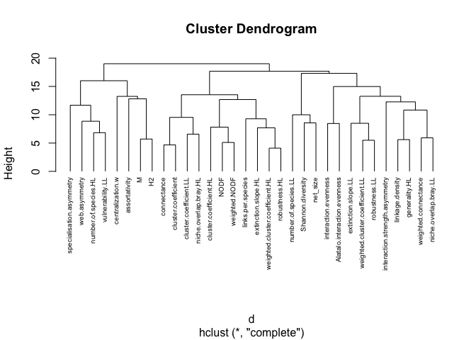
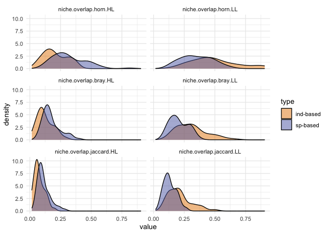
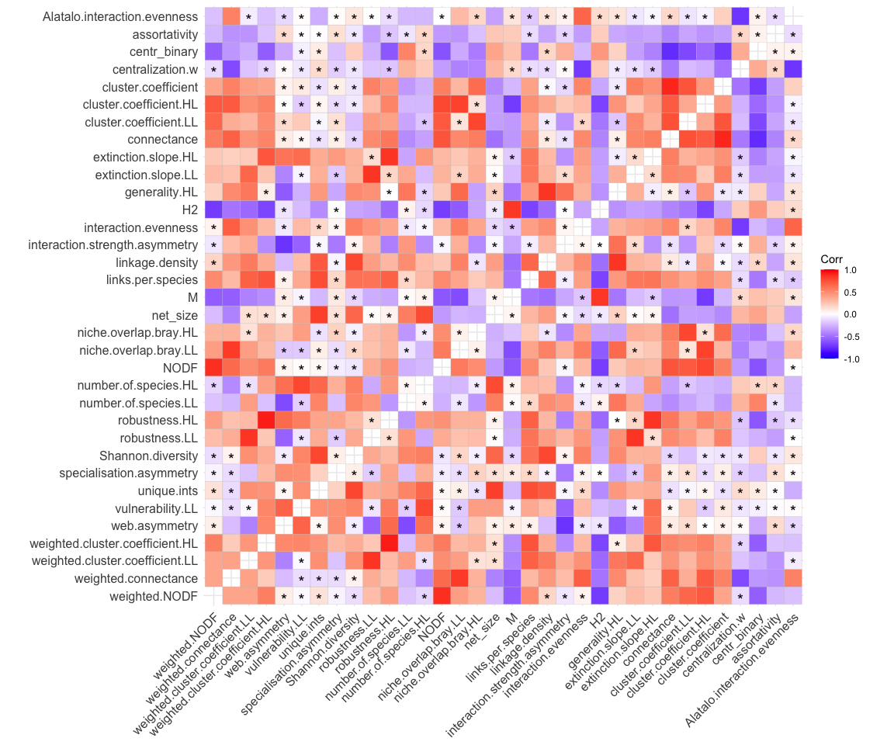
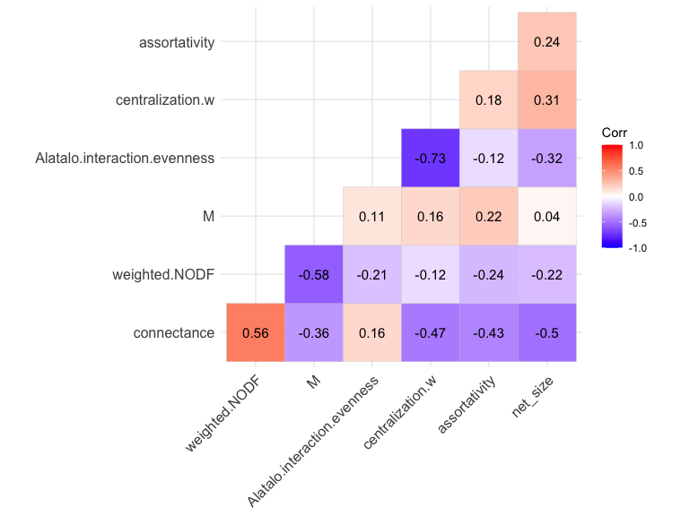
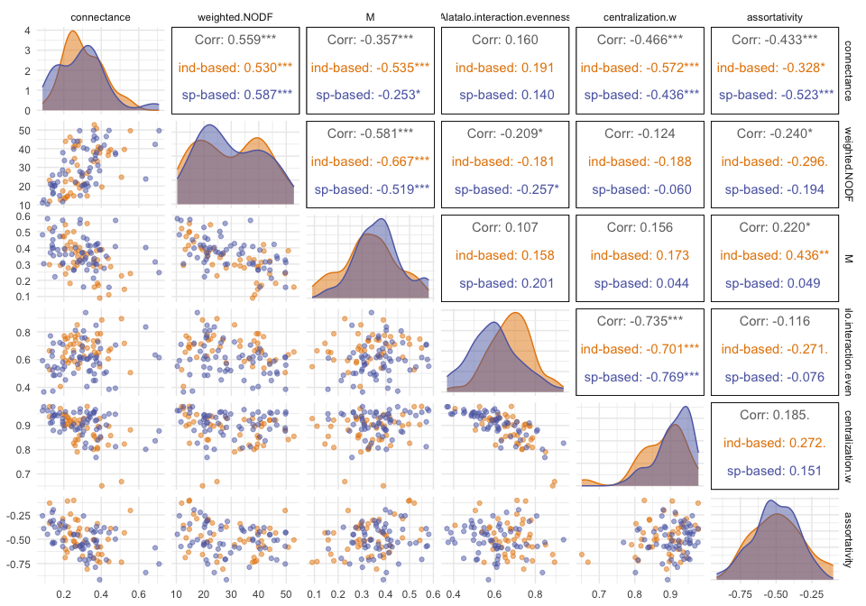
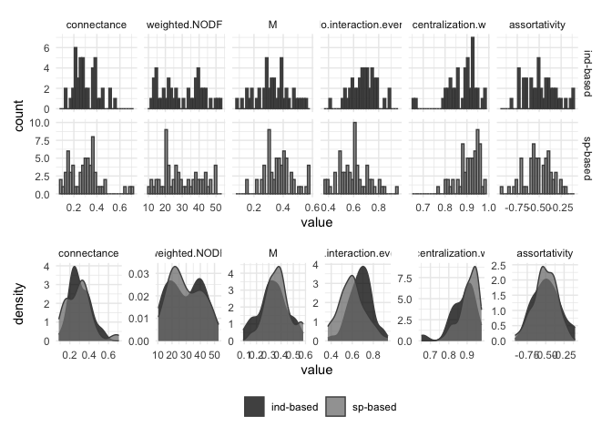

Exploration net-level metrics
================
Elena Quintero
2024-02-07

Libraries:

``` r
library(here)
library(tidyverse)
library(magrittr)
library(rcartocolor)
library(patchwork)
library(ggalt)
library(psych)
library(ggfortify)
library(ggrepel)
library(knitr)
library(kableExtra)
library(cluster)
library(GGally)
library(reshape2)
library(ggcorrplot)
theme_set(theme_minimal())
```

Load net-level metrics:

``` r
net.level <- read.csv(here("data/net.level.selection.csv")) %>%
  mutate(WC.new  = exp(Shannon.diversity)/net_size) %>%
  mutate(type = recode(type, "ind"="ind-based", "sp"="sp-based"))

glimpse(net.level)
```

    ## Rows: 105
    ## Columns: 51
    ## $ connectance                     <dbl> 0.3629630, 0.2093750, 0.3914286, 0.4…
    ## $ web.asymmetry                   <dbl> -0.19402985, -0.42857143, -0.5555555…
    ## $ links.per.species               <dbl> 5.850746, 2.392857, 3.044444, 3.4222…
    ## $ cluster.coefficient             <dbl> 0.22500000, 0.06250000, 0.25714286, …
    ## $ NODF                            <dbl> 67.21158, 63.51606, 72.48350, 71.689…
    ## $ weighted.NODF                   <dbl> 52.79227, 43.93032, 37.73835, 38.511…
    ## $ M                               <dbl> 0.15799305, 0.23921401, 0.09040128, …
    ## $ interaction.strength.asymmetry  <dbl> 0.098096343, 0.303002612, 1.19449172…
    ## $ specialisation.asymmetry        <dbl> 1.00000000, -0.48846320, -0.82692306…
    ## $ linkage.density                 <dbl> 16.046511, 9.152386, 10.990321, 13.9…
    ## $ weighted.connectance            <dbl> 0.2395002, 0.1634355, 0.2442293, 0.3…
    ## $ Shannon.diversity               <dbl> 4.933505, 3.959126, 3.653736, 4.1713…
    ## $ interaction.evenness            <dbl> 0.7063286, 0.6127286, 0.6237244, 0.7…
    ## $ Alatalo.interaction.evenness    <dbl> 0.6550250, 0.5924512, 0.5490386, 0.6…
    ## $ H2                              <dbl> 0.09933567, 0.24470407, 0.17791608, …
    ## $ number.of.species.HL            <int> 27, 16, 10, 10, 11, 10, 10, 13, 12, …
    ## $ number.of.species.LL            <int> 40, 40, 35, 35, 35, 13, 14, 14, 13, …
    ## $ cluster.coefficient.HL          <dbl> 0.9360087, 0.7633714, 0.9610723, 0.9…
    ## $ cluster.coefficient.LL          <dbl> 0.4297705, 0.2429504, 0.3870170, 0.4…
    ## $ weighted.cluster.coefficient.HL <dbl> 1.00000000, 0.75836703, 0.82419380, …
    ## $ weighted.cluster.coefficient.LL <dbl> 0.9675836, 0.8203872, 0.9500581, 0.9…
    ## $ niche.overlap.horn.HL           <dbl> 0.28227633, 0.09229992, 0.14771050, …
    ## $ niche.overlap.horn.LL           <dbl> 0.8377570, 0.6984493, 0.9032446, 0.9…
    ## $ extinction.slope.HL             <dbl> 10.730740, 3.721760, 4.293068, 5.561…
    ## $ extinction.slope.LL             <dbl> 7.822940, 2.596134, 5.649524, 6.7967…
    ## $ robustness.HL                   <dbl> 0.9145234, 0.7824115, 0.8078489, 0.8…
    ## $ robustness.LL                   <dbl> 0.8599260, 0.7138990, 0.8181298, 0.8…
    ## $ generality.HL                   <dbl> 27.560125, 15.435135, 20.212817, 25.…
    ## $ vulnerability.LL                <dbl> 4.532896, 2.869637, 1.767824, 2.3798…
    ## $ niche.overlap.bray.HL           <dbl> 0.09729529, 0.03883194, 0.07298345, …
    ## $ niche.overlap.bray.LL           <dbl> 0.5567506, 0.3390878, 0.4458126, 0.5…
    ## $ niche.overlap.jaccard.HL        <dbl> 0.05728874, 0.02443975, 0.04183463, …
    ## $ niche.overlap.jaccard.LL        <dbl> 0.40377235, 0.22904359, 0.31947895, …
    ## $ net_size                        <int> 1080, 640, 350, 350, 385, 130, 140, …
    ## $ net_id                          <chr> "01_01", "01_02", "02_01", "02_02", …
    ## $ links                           <dbl> 1, 1, 1, 1, 1, 1, 1, 1, 1, 1, 1, 1, …
    ## $ net_n                           <int> 1, 2, 3, 4, 5, 6, 7, 8, 9, 10, 11, 1…
    ## $ type                            <chr> "ind-based", "ind-based", "ind-based…
    ## $ net_code                        <chr> "ind_01_01", "ind_01_02", "ind_02_01…
    ## $ assortativity                   <dbl> -0.5071021, -0.6033629, -0.7374228, …
    ## $ centr_binary                    <dbl> 0.6210147, 0.7887529, 0.7122378, 0.6…
    ## $ centralization.w                <dbl> 0.8549594, 0.9221565, 0.9284492, 0.8…
    ## $ unique.ints                     <dbl> 392, 134, 137, 154, 148, 37, 33, 46,…
    ## $ code_ID                         <chr> "01_01", "01_02", "02_01", "02_02", …
    ## $ ref                             <chr> "Quintero et al 2023 Ecology letters…
    ## $ bioregion                       <lgl> NA, NA, NA, NA, NA, NA, NA, NA, NA, …
    ## $ country                         <chr> "Spain", "Spain", "Spain", "Spain", …
    ## $ plant_sp                        <chr> "Pistacia lentiscus", "Pistacia lent…
    ## $ n_nodes                         <int> 67, 56, 45, 45, 46, 23, 24, 27, 25, …
    ## $ study                           <chr> "ind_01", "ind_01", "ind_02", "ind_0…
    ## $ WC.new                          <dbl> 0.12857902, 0.08189298, 0.11033908, …

Cluster analysis for metrics:

``` r
df <- net.level %>% 
  dplyr::select(-c(net_id, links, net_n, type, net_code, unique.ints, code_ID,
                    ref, bioregion, country, plant_sp, n_nodes, study, WC.new)) %>%
  dplyr::select(-starts_with("niche.overlap.horn")) %>%
  dplyr::select(-starts_with("niche.overlap.jaccard")) %>%
  dplyr::select(-centr_binary) %>%
  scale() %>% t()

# Dissimilarity matrix
d <- dist(df, method = "euclidean")

# Hierarchical clustering using Complete Linkage
hc1 <- hclust(d, method = "complete")

# Plot the obtained dendrogram
plot(hc1, cex = 0.6, hang = -1)
```

<!-- -->

``` r
#rect.hclust(hc1, k = 10)
# save as PDF here("analysis/_exploratory_analysis/_exploratory_figs/cluster_metrics.pdf"), width = 7, height = 5)
```

Compare the three niche overlap metrics:

``` r
net.level %>%
  select(type, starts_with("niche")) %>% melt() %>%
  ggplot(aes(x = value, fill = type)) + 
  geom_density(alpha = 0.5) + 
  facet_wrap(~variable, ncol = 2) +
  scale_fill_carto_d()
```

<!-- -->

Correlation between metrics:

``` r
colnames(net.level)
```

    ##  [1] "connectance"                     "web.asymmetry"                  
    ##  [3] "links.per.species"               "cluster.coefficient"            
    ##  [5] "NODF"                            "weighted.NODF"                  
    ##  [7] "M"                               "interaction.strength.asymmetry" 
    ##  [9] "specialisation.asymmetry"        "linkage.density"                
    ## [11] "weighted.connectance"            "Shannon.diversity"              
    ## [13] "interaction.evenness"            "Alatalo.interaction.evenness"   
    ## [15] "H2"                              "number.of.species.HL"           
    ## [17] "number.of.species.LL"            "cluster.coefficient.HL"         
    ## [19] "cluster.coefficient.LL"          "weighted.cluster.coefficient.HL"
    ## [21] "weighted.cluster.coefficient.LL" "niche.overlap.horn.HL"          
    ## [23] "niche.overlap.horn.LL"           "extinction.slope.HL"            
    ## [25] "extinction.slope.LL"             "robustness.HL"                  
    ## [27] "robustness.LL"                   "generality.HL"                  
    ## [29] "vulnerability.LL"                "niche.overlap.bray.HL"          
    ## [31] "niche.overlap.bray.LL"           "niche.overlap.jaccard.HL"       
    ## [33] "niche.overlap.jaccard.LL"        "net_size"                       
    ## [35] "net_id"                          "links"                          
    ## [37] "net_n"                           "type"                           
    ## [39] "net_code"                        "assortativity"                  
    ## [41] "centr_binary"                    "centralization.w"               
    ## [43] "unique.ints"                     "code_ID"                        
    ## [45] "ref"                             "bioregion"                      
    ## [47] "country"                         "plant_sp"                       
    ## [49] "n_nodes"                         "study"                          
    ## [51] "WC.new"

``` r
all.net.metrics <- net.level %>%
  dplyr::select(-c(net_id, links, net_n, type, net_code,
                   code_ID, ref, bioregion, country,
                   plant_sp, n_nodes, study)) %>% 
  dplyr::select(-c(WC.new, starts_with("niche.overlap.horn"),
                   starts_with("niche.overlap.jaccard"))) %>% 
  select(order(desc(colnames(.)))) # arrange metrics by alphabetic order

corr_matrix <- cor(all.net.metrics)
p.mat <- cor_pmat(all.net.metrics, conf.level = 0.95)

ggcorrplot(corr_matrix, type = "full", show.diag = F,
           hc.order = F,
           p.mat = p.mat, pch = "*")
```

<!-- -->

``` r
glimpse(net.level)
```

    ## Rows: 105
    ## Columns: 51
    ## $ connectance                     <dbl> 0.3629630, 0.2093750, 0.3914286, 0.4…
    ## $ web.asymmetry                   <dbl> -0.19402985, -0.42857143, -0.5555555…
    ## $ links.per.species               <dbl> 5.850746, 2.392857, 3.044444, 3.4222…
    ## $ cluster.coefficient             <dbl> 0.22500000, 0.06250000, 0.25714286, …
    ## $ NODF                            <dbl> 67.21158, 63.51606, 72.48350, 71.689…
    ## $ weighted.NODF                   <dbl> 52.79227, 43.93032, 37.73835, 38.511…
    ## $ M                               <dbl> 0.15799305, 0.23921401, 0.09040128, …
    ## $ interaction.strength.asymmetry  <dbl> 0.098096343, 0.303002612, 1.19449172…
    ## $ specialisation.asymmetry        <dbl> 1.00000000, -0.48846320, -0.82692306…
    ## $ linkage.density                 <dbl> 16.046511, 9.152386, 10.990321, 13.9…
    ## $ weighted.connectance            <dbl> 0.2395002, 0.1634355, 0.2442293, 0.3…
    ## $ Shannon.diversity               <dbl> 4.933505, 3.959126, 3.653736, 4.1713…
    ## $ interaction.evenness            <dbl> 0.7063286, 0.6127286, 0.6237244, 0.7…
    ## $ Alatalo.interaction.evenness    <dbl> 0.6550250, 0.5924512, 0.5490386, 0.6…
    ## $ H2                              <dbl> 0.09933567, 0.24470407, 0.17791608, …
    ## $ number.of.species.HL            <int> 27, 16, 10, 10, 11, 10, 10, 13, 12, …
    ## $ number.of.species.LL            <int> 40, 40, 35, 35, 35, 13, 14, 14, 13, …
    ## $ cluster.coefficient.HL          <dbl> 0.9360087, 0.7633714, 0.9610723, 0.9…
    ## $ cluster.coefficient.LL          <dbl> 0.4297705, 0.2429504, 0.3870170, 0.4…
    ## $ weighted.cluster.coefficient.HL <dbl> 1.00000000, 0.75836703, 0.82419380, …
    ## $ weighted.cluster.coefficient.LL <dbl> 0.9675836, 0.8203872, 0.9500581, 0.9…
    ## $ niche.overlap.horn.HL           <dbl> 0.28227633, 0.09229992, 0.14771050, …
    ## $ niche.overlap.horn.LL           <dbl> 0.8377570, 0.6984493, 0.9032446, 0.9…
    ## $ extinction.slope.HL             <dbl> 10.730740, 3.721760, 4.293068, 5.561…
    ## $ extinction.slope.LL             <dbl> 7.822940, 2.596134, 5.649524, 6.7967…
    ## $ robustness.HL                   <dbl> 0.9145234, 0.7824115, 0.8078489, 0.8…
    ## $ robustness.LL                   <dbl> 0.8599260, 0.7138990, 0.8181298, 0.8…
    ## $ generality.HL                   <dbl> 27.560125, 15.435135, 20.212817, 25.…
    ## $ vulnerability.LL                <dbl> 4.532896, 2.869637, 1.767824, 2.3798…
    ## $ niche.overlap.bray.HL           <dbl> 0.09729529, 0.03883194, 0.07298345, …
    ## $ niche.overlap.bray.LL           <dbl> 0.5567506, 0.3390878, 0.4458126, 0.5…
    ## $ niche.overlap.jaccard.HL        <dbl> 0.05728874, 0.02443975, 0.04183463, …
    ## $ niche.overlap.jaccard.LL        <dbl> 0.40377235, 0.22904359, 0.31947895, …
    ## $ net_size                        <int> 1080, 640, 350, 350, 385, 130, 140, …
    ## $ net_id                          <chr> "01_01", "01_02", "02_01", "02_02", …
    ## $ links                           <dbl> 1, 1, 1, 1, 1, 1, 1, 1, 1, 1, 1, 1, …
    ## $ net_n                           <int> 1, 2, 3, 4, 5, 6, 7, 8, 9, 10, 11, 1…
    ## $ type                            <chr> "ind-based", "ind-based", "ind-based…
    ## $ net_code                        <chr> "ind_01_01", "ind_01_02", "ind_02_01…
    ## $ assortativity                   <dbl> -0.5071021, -0.6033629, -0.7374228, …
    ## $ centr_binary                    <dbl> 0.6210147, 0.7887529, 0.7122378, 0.6…
    ## $ centralization.w                <dbl> 0.8549594, 0.9221565, 0.9284492, 0.8…
    ## $ unique.ints                     <dbl> 392, 134, 137, 154, 148, 37, 33, 46,…
    ## $ code_ID                         <chr> "01_01", "01_02", "02_01", "02_02", …
    ## $ ref                             <chr> "Quintero et al 2023 Ecology letters…
    ## $ bioregion                       <lgl> NA, NA, NA, NA, NA, NA, NA, NA, NA, …
    ## $ country                         <chr> "Spain", "Spain", "Spain", "Spain", …
    ## $ plant_sp                        <chr> "Pistacia lentiscus", "Pistacia lent…
    ## $ n_nodes                         <int> 67, 56, 45, 45, 46, 23, 24, 27, 25, …
    ## $ study                           <chr> "ind_01", "ind_01", "ind_02", "ind_0…
    ## $ WC.new                          <dbl> 0.12857902, 0.08189298, 0.11033908, …

``` r
metrics.of.interest.size <- c("connectance", 
                         "weighted.NODF", 
                         "M", 
                         "Alatalo.interaction.evenness",
                         "centralization.w",
                         "assortativity",
                         "net_size")

#Remove net_size
metrics.of.interest <- metrics.of.interest.size[metrics.of.interest.size != "net_size"]
```

Correlation between selected metrics:

``` r
corr_matrix <- cor(net.level[, metrics.of.interest.size])
p.mat <- cor_pmat(net.level[, metrics.of.interest.size], conf.level = 0.95)

ggcorrplot(corr_matrix, type = "lower",  lab = T) 
```

<!-- -->

``` r
ggsave(here("figs/cor_net_metrics_new.pdf"), width = 7, height=7)
```

VIF:

``` r
source(here("functions/vif_function.R"))

vif_func(in_frame = net.level[, metrics.of.interest], thresh = 4, trace = T)
```

    ##  var                          vif             
    ##  connectance                  2.1697075620989 
    ##  weighted.NODF                2.15223896561383
    ##  M                            1.560020304361  
    ##  Alatalo.interaction.evenness 2.79505933577192
    ##  centralization.w             3.14731247000826
    ##  assortativity                1.26088017476415
    ## 
    ## All variables have VIF < 4, max VIF 3.15

    ## [1] "connectance"                  "weighted.NODF"               
    ## [3] "M"                            "Alatalo.interaction.evenness"
    ## [5] "centralization.w"             "assortativity"

Full comparison metrics:

``` r
ggpairs(net.level, columns = metrics.of.interest, 
        aes(color = type, fill = type),
        diag = list(continuous = wrap("densityDiag", alpha = 0.5)),
        lower = list(continuous = wrap("points", alpha = 0.5))) +
  scale_color_carto_d() +
  scale_fill_carto_d()
```

<!-- -->

Selected metrics distribution:

``` r
p1 <- ggplot(melt(net.level[, c("type", metrics.of.interest)]), 
            aes(x=value, fill = type)) + 
  geom_histogram(alpha = 0.75, color = "grey30") +
  scale_fill_manual(values = c("black", "grey50")) +
  facet_grid(type~variable, scales = "free") + 
  labs(color = NULL, fill = NULL)

p2 <- ggplot(melt(net.level[, c("type", metrics.of.interest)]), 
            aes(x=value, fill = type)) + 
  geom_density(alpha = 0.75, color = "grey30") +
  scale_fill_manual(values = c("black", "grey50")) +
  facet_wrap(~variable, scales = "free", nrow = 1) + 
  labs(color = NULL, fill = NULL)

p1 / p2 + plot_layout(heights = c(2,1), guides = 'collect') & theme(legend.position = "bottom")
```

<!-- -->

``` r
ggsave(here("figs/net_metrics_distribution_new.pdf"), width = 10, height = 6)
```

Summary numbers:

``` r
summary(net.level[, c("type", metrics.of.interest)])
```

    ##      type            connectance      weighted.NODF         M         
    ##  Length:105         Min.   :0.08604   Min.   :10.35   Min.   :0.0904  
    ##  Class :character   1st Qu.:0.20856   1st Qu.:20.43   1st Qu.:0.2949  
    ##  Mode  :character   Median :0.29762   Median :27.85   Median :0.3593  
    ##                     Mean   :0.30027   Mean   :29.72   Mean   :0.3544  
    ##                     3rd Qu.:0.37179   3rd Qu.:39.75   3rd Qu.:0.4153  
    ##                     Max.   :0.70833   Max.   :52.79   Max.   :0.5803  
    ##  Alatalo.interaction.evenness centralization.w assortativity    
    ##  Min.   :0.3673               Min.   :0.6509   Min.   :-0.9162  
    ##  1st Qu.:0.5490               1st Qu.:0.8606   1st Qu.:-0.5909  
    ##  Median :0.6247               Median :0.9073   Median :-0.5071  
    ##  Mean   :0.6330               Mean   :0.8957   Mean   :-0.4969  
    ##  3rd Qu.:0.7170               3rd Qu.:0.9391   3rd Qu.:-0.3873  
    ##  Max.   :0.9381               Max.   :0.9784   Max.   :-0.1002

``` r
net.level[, c("type", metrics.of.interest)] %>%
  #group_by(type) %>% 
  summarise_at(vars(connectance:assortativity), sd)
```

    ##   connectance weighted.NODF        M Alatalo.interaction.evenness
    ## 1   0.1208721      11.61772 0.105718                    0.1201532
    ##   centralization.w assortativity
    ## 1       0.06011631     0.1647885

``` r
ind <- net.level[, c("type", metrics.of.interest)] %>% filter(type == "ind-based")
sp <- net.level[, c("type", metrics.of.interest)] %>% filter(type == "sp-based")
summary(ind)
```

    ##      type            connectance     weighted.NODF         M         
    ##  Length:44          Min.   :0.1231   Min.   :11.91   Min.   :0.0904  
    ##  Class :character   1st Qu.:0.2307   1st Qu.:19.38   1st Qu.:0.2767  
    ##  Mode  :character   Median :0.2805   Median :29.66   Median :0.3306  
    ##                     Mean   :0.3058   Mean   :29.90   Mean   :0.3318  
    ##                     3rd Qu.:0.3794   3rd Qu.:39.68   3rd Qu.:0.3963  
    ##                     Max.   :0.5553   Max.   :52.79   Max.   :0.5503  
    ##  Alatalo.interaction.evenness centralization.w assortativity    
    ##  Min.   :0.4067               Min.   :0.6509   Min.   :-0.8073  
    ##  1st Qu.:0.6141               1st Qu.:0.8409   1st Qu.:-0.6109  
    ##  Median :0.6862               Median :0.8972   Median :-0.5028  
    ##  Mean   :0.6798               Mean   :0.8770   Mean   :-0.4810  
    ##  3rd Qu.:0.7439               3rd Qu.:0.9227   3rd Qu.:-0.3694  
    ##  Max.   :0.8940               Max.   :0.9784   Max.   :-0.1002

``` r
summary(sp)
```

    ##      type            connectance      weighted.NODF         M         
    ##  Length:61          Min.   :0.08604   Min.   :10.35   Min.   :0.1568  
    ##  Class :character   1st Qu.:0.19340   1st Qu.:20.43   1st Qu.:0.3083  
    ##  Mode  :character   Median :0.29825   Median :27.76   Median :0.3685  
    ##                     Mean   :0.29628   Mean   :29.59   Mean   :0.3706  
    ##                     3rd Qu.:0.36842   3rd Qu.:39.75   3rd Qu.:0.4158  
    ##                     Max.   :0.70833   Max.   :49.84   Max.   :0.5803  
    ##  Alatalo.interaction.evenness centralization.w assortativity    
    ##  Min.   :0.3673               Min.   :0.7681   Min.   :-0.9162  
    ##  1st Qu.:0.5160               1st Qu.:0.8836   1st Qu.:-0.5878  
    ##  Median :0.6023               Median :0.9194   Median :-0.5124  
    ##  Mean   :0.5993               Mean   :0.9093   Mean   :-0.5083  
    ##  3rd Qu.:0.6650               3rd Qu.:0.9480   3rd Qu.:-0.3913  
    ##  Max.   :0.9381               Max.   :0.9774   Max.   :-0.1973

``` r
net.level[, c("type", metrics.of.interest)] %>%
  group_by(type) %>% 
  summarise_at(vars(connectance:assortativity), sd)
```

    ## # A tibble: 2 × 7
    ##   type      connectance weighted.NODF      M Alatalo.interac… centralization.w
    ##   <chr>           <dbl>         <dbl>  <dbl>            <dbl>            <dbl>
    ## 1 ind-based       0.102          12.1 0.114            0.0999           0.0692
    ## 2 sp-based        0.133          11.4 0.0969           0.123            0.0489
    ## # … with 1 more variable: assortativity <dbl>

``` r
#coefficient of variation
net.level[, c("type", metrics.of.interest)] %>%
  #group_by(type) %>% 
  summarise(cv_con = sd(connectance) / mean(connectance) * 100,
            cv_nodf = sd(weighted.NODF) / mean(weighted.NODF) * 100,
            cv_mod = sd(M) / mean(M) * 100,
            cv_cen = sd(centralization.w) / mean(centralization.w) * 100,
            cv_ass = sd(assortativity) / mean(assortativity) * 100)
```

    ##     cv_con  cv_nodf   cv_mod   cv_cen    cv_ass
    ## 1 40.25507 39.09078 29.83405 6.711493 -33.16604
