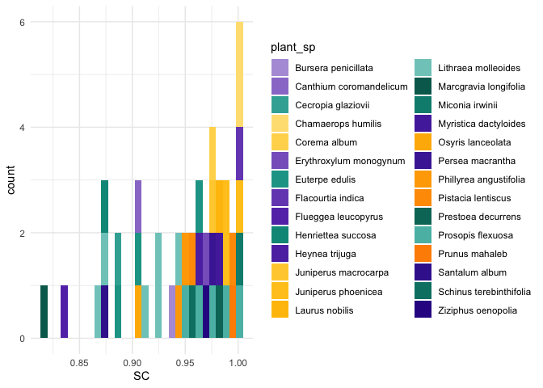

Sampling completeness
================
Elena Quintero
2024-02-07

``` r
library(here)
library(tidyverse)
library(magrittr)
library(reshape2)
library(patchwork)
library(ggalt)
library(iNEXT)

theme_set(theme_minimal())
```

Load colors and other attributes:

``` r
net_cols <- read_csv(here("data/net_colors.csv"))

cols.plants <- as.character(net_cols$cols_continent3)
names(cols.plants) <- as.character(net_cols$plant_sp)

cols.cont <- as.character(net_cols$cols_continent4)
names(cols.cont) <- as.character(net_cols$continent)

nets_info <- read_csv(here("data/net.level.selection.csv")) %>%
  left_join(net_cols) %>%
  filter(type == "ind") %>%
  select(-c(connectance:centralization.w, cols_country:cols_continent4)) %>%
  rename(net_id = code_ID)

glimpse(nets_info)
```

    ## Rows: 44
    ## Columns: 10
    ## $ unique.ints     <dbl> 392, 134, 137, 154, 148, 37, 33, 46, 41, 29, 25, 87,…
    ## $ net_id          <chr> "01_01", "01_02", "02_01", "02_02", "02_03", "03_01"…
    ## $ ref             <chr> "Quintero et al 2023 Ecology letters", "Quintero et …
    ## $ bioregion       <lgl> NA, NA, NA, NA, NA, NA, NA, NA, NA, NA, NA, NA, NA, …
    ## $ country         <chr> "Spain", "Spain", "Spain", "Spain", "Spain", "Argent…
    ## $ plant_sp        <chr> "Pistacia lentiscus", "Pistacia lentiscus", "Juniper…
    ## $ n_nodes         <dbl> 67, 56, 45, 45, 46, 23, 24, 27, 25, 23, 18, 35, 39, …
    ## $ study           <chr> "ind_01", "ind_01", "ind_02", "ind_02", "ind_02", "i…
    ## $ continent       <chr> "Europe", "Europe", "Europe", "Europe", "Europe", "A…
    ## $ plant_plot_rank <dbl> 27, 27, 23, 23, 23, 1, 1, 1, 1, 1, 1, 24, 28, 4, 4, …

Read all networks:

``` r
#Read list of names
nets_names <- list.files(path = here("networks/"), pattern = "_int")

#Create empty list
nets <- list()

#Add all read files to the list
for (i in 1:length(nets_names)){
  net_file <- paste0("networks/", nets_names[[i]])
  net <- read.csv(here(net_file))
  
  if(ncol(net)<2){
    net <- read.csv(here(net_file), sep = ";") #For those datasets saved with ; separation
  } else
  {}  

  net %<>% mutate(ind = as.factor(ind))#column_to_rownames("ind")
  nets[[i]] <- net #add to list
  names(nets)[i] <- nets_names[[i]] #name the list

  # assign(nets_names[[i]], net)
}
```

Read nets characteristics (name, site etc…)

``` r
nets_ID <- readxl::read_xlsx(here("data/selected_individual_networks.xlsx")) %>%
  select(net_id = code_ID,
         ref,
         plant_sp = `focus species`,
         pop = pop_site) %>%
  mutate(net_name = paste0(plant_sp, "_", pop)) %>%
  group_by(net_id) %>%
  mutate(net_n = cur_group_id())
```

``` r
nets.melted <- melt(nets) %>%
  rename(animal = variable) %>%
  rename(int = value) %>%
  mutate(net_id = str_sub(L1, 1,5)) %>%
  left_join(nets_ID, by = "net_id") %>%
  mutate(study_n = as.numeric(str_sub(L1, 1,2)),
         subnet_n = as.numeric(str_sub(L1, 4,5))) %>%
  filter(!net_id %in% c("08_01", "12_01", "12_06", "12_07")) #remove nets with few observations

glimpse(nets.melted)
```

    ## Rows: 13,124
    ## Columns: 12
    ## $ ind      <fct> 301, 302, 303, 304, 305, 306, 307, 308, 309, 310, 311, 312,…
    ## $ animal   <fct> Chloris_chloris, Chloris_chloris, Chloris_chloris, Chloris_…
    ## $ int      <dbl> 620.1295, 708.4433, 1053.1714, 1659.1382, 782.7789, 712.135…
    ## $ L1       <chr> "01_01_int.csv", "01_01_int.csv", "01_01_int.csv", "01_01_i…
    ## $ net_id   <chr> "01_01", "01_01", "01_01", "01_01", "01_01", "01_01", "01_0…
    ## $ ref      <chr> "Quintero et al 2023 Ecology letters", "Quintero et al 2023…
    ## $ plant_sp <chr> "Pistacia lentiscus", "Pistacia lentiscus", "Pistacia lenti…
    ## $ pop      <chr> "El Puntal", "El Puntal", "El Puntal", "El Puntal", "El Pun…
    ## $ net_name <chr> "Pistacia lentiscus_El Puntal", "Pistacia lentiscus_El Punt…
    ## $ net_n    <int> 1, 1, 1, 1, 1, 1, 1, 1, 1, 1, 1, 1, 1, 1, 1, 1, 1, 1, 1, 1,…
    ## $ study_n  <dbl> 1, 1, 1, 1, 1, 1, 1, 1, 1, 1, 1, 1, 1, 1, 1, 1, 1, 1, 1, 1,…
    ## $ subnet_n <dbl> 1, 1, 1, 1, 1, 1, 1, 1, 1, 1, 1, 1, 1, 1, 1, 1, 1, 1, 1, 1,…

## Calculate sampling completeness

### Using inext

Incidence-frequency data: input data for each assemblage consist of the
number of sampling units (T) followed by the observed incidence
frequencies (Y1 , Y2 , . .., YS ). When there are N assemblages, input
data consist of an S + 1 by N matrix or N lists of species incidence
frequencies. The first entry of each column/list must be the total
number of sampling units, followed by the species incidence
frequencies - this is qualitative, is not considering the abundance of
frugivore species, just the number of frugivores detected in each plant.

``` r
inext_sc  <- data.frame()

for (i in 1:length(unique(nets.melted$study_n))){

  net <- nets.melted %>% filter(study_n == i) 
  nets_se <- list()
  
  for (i in unique(net$subnet_n)){
    subnet <- net %>% filter(subnet_n == i)
    
    if (isTRUE(length(unique(subnet$ind)) >= 3)) {
       
    sp_detected <- as.data.frame(subnet) %>% group_by(animal) %>% 
                       filter(int != 0) %>% count()
    
    nets_se[[i]] <-  c(length(unique(subnet$ind)), 
                        sp_detected$n)
    
    names(nets_se)[i] <- unique(subnet$net_id)
    
    
    }
    else
    {}
                              
  }
  
  nets_se[sapply(nets_se, is.null)] <- NULL

  out <- iNEXT(nets_se, q = 0, datatype = "incidence_freq")

  inext_sc <- rbind(inext_sc, out$iNextEst$size_based %>% filter(Method == "Observed"))
  
}
```

Plot sampling coverage:

``` r
glimpse(inext_sc)
```

    ## Rows: 44
    ## Columns: 10
    ## $ Assemblage <chr> "01_01", "01_02", "02_01", "02_02", "02_03", "03_01", "03…
    ## $ t          <dbl> 40, 40, 35, 35, 35, 13, 14, 14, 13, 12, 11, 18, 19, 17, 1…
    ## $ Method     <chr> "Observed", "Observed", "Observed", "Observed", "Observed…
    ## $ Order.q    <dbl> 0, 0, 0, 0, 0, 0, 0, 0, 0, 0, 0, 0, 0, 0, 0, 0, 0, 0, 0, …
    ## $ qD         <dbl> 27, 16, 10, 10, 11, 10, 10, 13, 12, 11, 7, 17, 20, 9, 7, …
    ## $ qD.LCL     <dbl> 24.402227, 12.607322, 7.864316, 7.934480, 10.274170, 7.18…
    ## $ qD.UCL     <dbl> 29.597773, 19.392678, 12.135684, 12.065520, 11.725830, 12…
    ## $ SC         <dbl> 0.9925999, 0.9559764, 0.9858186, 0.9873840, 1.0000000, 0.…
    ## $ SC.LCL     <dbl> 0.9859196, 0.9297755, 0.9675867, 0.9746555, 0.9897194, 0.…
    ## $ SC.UCL     <dbl> 0.9992803, 0.9821773, 1.0000000, 1.0000000, 1.0000000, 0.…

``` r
sc <- inext_sc %>% 
  rename(net_id = Assemblage) %>%
  left_join(nets_info)

glimpse(sc)
```

    ## Rows: 44
    ## Columns: 19
    ## $ net_id          <chr> "01_01", "01_02", "02_01", "02_02", "02_03", "03_01"…
    ## $ t               <dbl> 40, 40, 35, 35, 35, 13, 14, 14, 13, 12, 11, 18, 19, …
    ## $ Method          <chr> "Observed", "Observed", "Observed", "Observed", "Obs…
    ## $ Order.q         <dbl> 0, 0, 0, 0, 0, 0, 0, 0, 0, 0, 0, 0, 0, 0, 0, 0, 0, 0…
    ## $ qD              <dbl> 27, 16, 10, 10, 11, 10, 10, 13, 12, 11, 7, 17, 20, 9…
    ## $ qD.LCL          <dbl> 24.402227, 12.607322, 7.864316, 7.934480, 10.274170,…
    ## $ qD.UCL          <dbl> 29.597773, 19.392678, 12.135684, 12.065520, 11.72583…
    ## $ SC              <dbl> 0.9925999, 0.9559764, 0.9858186, 0.9873840, 1.000000…
    ## $ SC.LCL          <dbl> 0.9859196, 0.9297755, 0.9675867, 0.9746555, 0.989719…
    ## $ SC.UCL          <dbl> 0.9992803, 0.9821773, 1.0000000, 1.0000000, 1.000000…
    ## $ unique.ints     <dbl> 392, 134, 137, 154, 148, 37, 33, 46, 41, 29, 25, 87,…
    ## $ ref             <chr> "Quintero et al 2023 Ecology letters", "Quintero et …
    ## $ bioregion       <lgl> NA, NA, NA, NA, NA, NA, NA, NA, NA, NA, NA, NA, NA, …
    ## $ country         <chr> "Spain", "Spain", "Spain", "Spain", "Spain", "Argent…
    ## $ plant_sp        <chr> "Pistacia lentiscus", "Pistacia lentiscus", "Juniper…
    ## $ n_nodes         <dbl> 67, 56, 45, 45, 46, 23, 24, 27, 25, 23, 18, 35, 39, …
    ## $ study           <chr> "ind_01", "ind_01", "ind_02", "ind_02", "ind_02", "i…
    ## $ continent       <chr> "Europe", "Europe", "Europe", "Europe", "Europe", "A…
    ## $ plant_plot_rank <dbl> 27, 27, 23, 23, 23, 1, 1, 1, 1, 1, 1, 24, 28, 4, 4, …

``` r
write_csv(sc, here("data/sampling_coverage_inext.csv"))
```

``` r
ggplot(sc, aes(x = SC, fill = plant_sp)) + 
  geom_histogram() + 
  scale_fill_manual(values = cols.plants)
```

<!-- -->

Species Accumulation Curves for each study:

``` r
plot_list = list()

for (i in 1:length(unique(nets.melted$study_n))){

  net <- nets.melted %>% filter(study_n == i) 
  nets_se <- list()
  
  for (z in unique(net$subnet_n)){
    subnet <- net %>% filter(subnet_n == z)
    
    if (isTRUE(length(unique(subnet$ind)) >= 3)) {
       
    sp_detected <- as.data.frame(subnet) %>% group_by(animal) %>% 
                       filter(int != 0) %>% count()
    
    nets_se[[z]] <-  c(length(unique(subnet$ind)), 
                        sp_detected$n)
    
    names(nets_se)[z] <- ifelse(unique(subnet$pop) == "NA",
                                unique(subnet$plant_sp), 
                                unique(subnet$pop))
    }
    else
    {}
                              
  }
  
  nets_se[sapply(nets_se, is.null)] <- NULL

  out <- iNEXT(nets_se, q = 0, datatype = "incidence_freq")
  
  #Plot species diversity
  plot <- ggiNEXT(out, type = 1,
                  color.var = "Assemblage") + 
    theme_bw() +
    labs(title = unique(net$ref),
         x = "Number of individual plants",
         y = "Frugivore species diversity") +
    scale_shape_manual(values = rep(16, length(nets_se))) +
    theme(legend.position = "bottom")

  plot_list[[i]] = plot

  }
```

Save all plots to a pdf (several plots per page)

``` r
# ggsave(
#    filename = "figs/sampling_coverage.pdf", 
#    plot = gridExtra::marrangeGrob(plot_list, nrow=5, ncol=2),
#    width = 10, height = 15
# )
```
