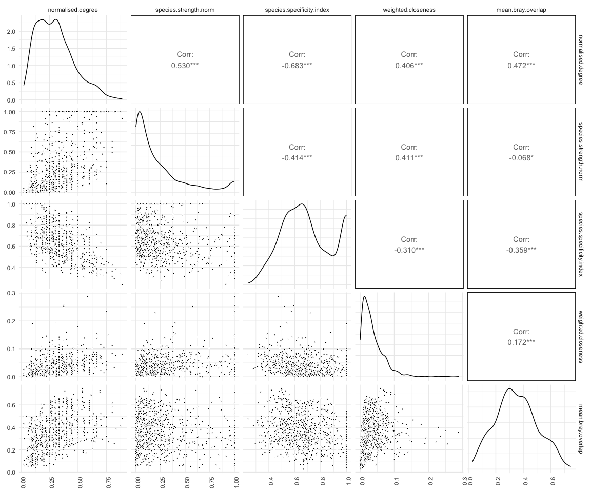
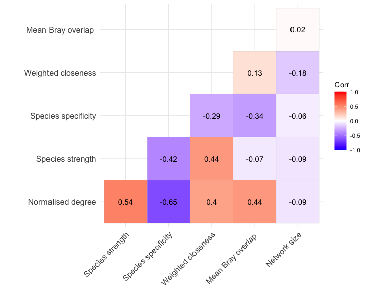
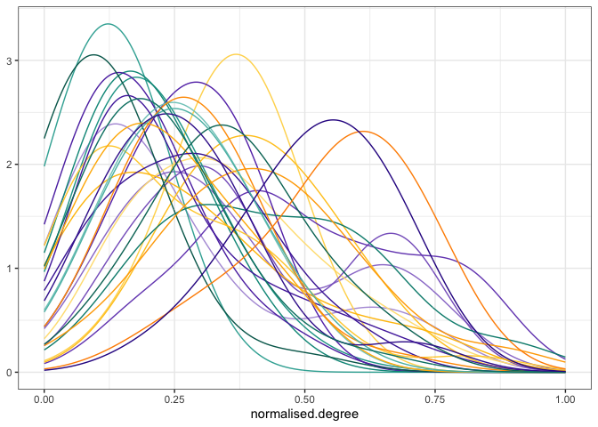
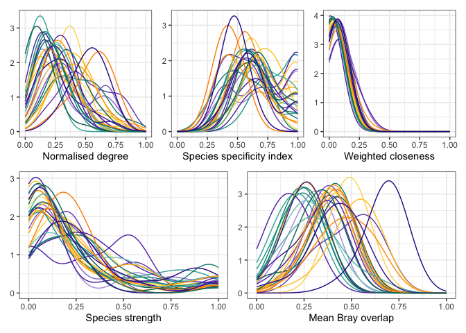
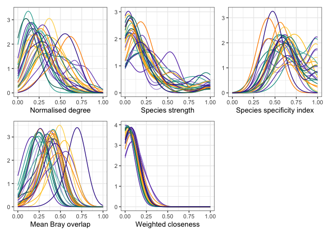

Exploration of node level metrics - manual calculation and selection
================
Elena Quintero
2024-02-07

Libraries:

``` r
library(here)
library(bipartite)
library(igraph)
library(tidyverse)
library(tidylog)
library(magrittr)
library(reshape2)
library(patchwork)
library(ggpubr)
library(rcartocolor)
library(GGally)
library(reshape2)
```

------------------------------------------------------------------------

Load all networks metrics:

``` r
ind.level.df <- read.csv(here("data/node.level.selection.csv"))

glimpse(ind.level.df)
```

    ## Rows: 995
    ## Columns: 41
    ## $ net_n                         <int> 1, 1, 1, 1, 1, 1, 1, 1, 1, 1, 1, 1, 1,…
    ## $ net_id                        <chr> "01_01", "01_01", "01_01", "01_01", "0…
    ## $ study                         <int> 1, 1, 1, 1, 1, 1, 1, 1, 1, 1, 1, 1, 1,…
    ## $ ind_ID                        <chr> "01_01_301", "01_01_302", "01_01_303",…
    ## $ ind                           <chr> "301", "302", "303", "304", "305", "30…
    ## $ degree                        <int> 11, 15, 9, 19, 5, 11, 7, 7, 9, 7, 8, 7…
    ## $ normalised.degree             <dbl> 0.4074074, 0.5555556, 0.3333333, 0.703…
    ## $ species.strength              <dbl> 0.85051099, 2.68245083, 0.13992168, 3.…
    ## $ interaction.push.pull         <dbl> -0.013589910, 0.112163389, -0.09556425…
    ## $ nestedrank                    <dbl> 0.20512821, 0.07692308, 0.58974359, 0.…
    ## $ PDI                           <dbl> 0.9523748, 0.9401682, 0.9577912, 0.927…
    ## $ species.specificity.index     <dbl> 0.5295019, 0.4518455, 0.5550037, 0.436…
    ## $ resource.range                <dbl> 0.6153846, 0.4615385, 0.6923077, 0.307…
    ## $ PSI                           <dbl> 0.85051099, 2.68245083, 0.13992168, 3.…
    ## $ node.specialisation.index.NSI <dbl> 1, 1, 1, 1, 1, 1, 1, 1, 1, 1, 1, 1, 1,…
    ## $ betweenness                   <dbl> 0, 0, 0, 0, 0, 0, 0, 0, 0, 0, 0, 0, 0,…
    ## $ weighted.betweenness          <dbl> 0.00000000, 0.00000000, 0.00000000, 0.…
    ## $ closeness                     <dbl> 0.025, 0.025, 0.025, 0.025, 0.025, 0.0…
    ## $ weighted.closeness            <dbl> 0.031765756, 0.030524084, 0.014375754,…
    ## $ Fisher.alpha                  <lgl> NA, NA, NA, NA, NA, NA, NA, NA, NA, NA…
    ## $ partner.diversity             <dbl> 1.429485, 1.753430, 1.322201, 1.784777…
    ## $ effective.partners            <dbl> 4.176546, 5.774377, 3.751668, 5.958250…
    ## $ proportional.similarity       <dbl> 0.7557782, 0.7745749, 0.7720482, 0.801…
    ## $ proportional.generality       <dbl> 0.7998651, 1.1058714, 0.7184952, 1.141…
    ## $ d                             <dbl> 0, 0, 0, 0, 0, 0, 0, 0, 0, 0, 0, 0, 0,…
    ## $ mean.bray.overlap             <dbl> 0.5754007, 0.5782921, 0.5968529, 0.415…
    ## $ mean.jaccard.overlap          <dbl> 0.4182767, 0.4215563, 0.4405808, 0.283…
    ## $ eigen.centrality              <dbl> 0.24815105, 0.22843692, 0.11912347, 0.…
    ## $ tm.closeness                  <dbl> 0.03039829, 0.03329066, 0.02345089, 0.…
    ## $ tm.w.closeness                <dbl> 0.031202628, 0.031920244, 0.014090767,…
    ## $ tm.betweenness                <dbl> 0.0, 0.5, 0.0, 149.5, 0.0, 0.0, 0.0, 0…
    ## $ tm.w.betweenness              <dbl> 0, 0, 0, 89, 0, 0, 0, 0, 0, 0, 0, 0, 0…
    ## $ ref                           <chr> "Quintero et al 2023 Ecology letters",…
    ## $ plant_sp                      <chr> "Pistacia lentiscus", "Pistacia lentis…
    ## $ pop                           <chr> "El Puntal", "El Puntal", "El Puntal",…
    ## $ country                       <chr> "Spain", "Spain", "Spain", "Spain", "S…
    ## $ net_name                      <chr> "Pistacia lentiscus_El Puntal", "Pista…
    ## $ continent                     <chr> "Europe", "Europe", "Europe", "Europe"…
    ## $ plant_plot_rank               <int> 27, 27, 27, 27, 27, 27, 27, 27, 27, 27…
    ## $ cols_continent3               <chr> "#FF9B00", "#FF9B00", "#FF9B00", "#FF9…
    ## $ cols_continent4               <chr> "#FFCA28FF", "#FFCA28FF", "#FFCA28FF",…

Normalization function:

``` r
min_max_norm <- function(x){(x-min(x))/(max(x)-min(x))}
```

Normalize species strength:

``` r
ind.level.df %<>% 
  group_by(net_id) %>% 
  mutate(species.strength.norm = min_max_norm(species.strength))
```

Full comparison metrics:

``` r
metrics <- c("normalised.degree",
              #"proportional.generality",
             "species.strength.norm",
             #"interaction.push.pull",
             "species.specificity.index",
             "weighted.closeness",
             #"proportional.similarity",
             #"d",
             "mean.bray.overlap")

#colnames(ind.level.df)

ggpairs(
 ind.level.df, columns = metrics,
 lower = list(continuous = wrap("points", pch = 21, color = "white", fill= "black", size = 0.75))) + 
  theme(axis.text.x = element_text(angle = 90, hjust = 1))
```

<!-- -->

``` r
interest.metrics <- ind.level.df %>% ungroup() %>% dplyr::select(all_of(metrics))

source(here("functions/vif_function.R"))

vif_func(in_frame = as.data.frame(interest.metrics), thresh = 3, trace = T)
```

    ##  var                       vif             
    ##  normalised.degree         2.85396638582471
    ##  species.strength.norm     1.85343569046605
    ##  species.specificity.index 1.90740989193022
    ##  weighted.closeness        1.29076350163857
    ##  mean.bray.overlap         1.60178389900207
    ## 
    ## All variables have VIF < 3, max VIF 2.85

    ## [1] "normalised.degree"         "species.strength.norm"    
    ## [3] "species.specificity.index" "weighted.closeness"       
    ## [5] "mean.bray.overlap"

Metrics correlation:

``` r
net.level <- read.csv(here("data/net.level.selection.csv"))
n.animals <- net.level %>% 
  dplyr::select(net_id, 
         animals = number.of.species.HL, 
         net_size)

df <- ind.level.df %>%
  ungroup() %>% 
  dplyr::select(net_id, all_of(metrics)) %>%
  group_by(net_id) %>%
  mutate(plants = n()) %>%
  left_join(n.animals) %>%
  rename("Normalised degree" = normalised.degree,
         "Species strength" = species.strength.norm,
         "Species specificity" = species.specificity.index,
         "Weighted closeness" = weighted.closeness,
         "Mean Bray overlap " = mean.bray.overlap,
         "Network size" = net_size)

library(ggcorrplot)
corr_matrix <- cor(df[-c(1,7,8)])
p.mat <- cor_pmat(df[-c(1,7,8)])

ggcorrplot(corr_matrix, type = "lower", show.diag = F,
           hc.order = F, lab = T)
```

<!-- -->

``` r
ggsave(here("figs/cor_node_metrics.pdf"), width = 6, height = 6)
```

## Node metrics distibution:

``` r
#Net colors:
mycols <- as.character(ind.level.df$cols_continent3)
names(mycols) <- as.character(ind.level.df$plant_sp)
theme_set(theme_bw())
```

# Plot metrics distribution by net

``` r
plot_density_metric <- function(metric){
    plot <- ggplot(ind.level.df, aes(x = {{metric}}, color = plant_sp)) + 
        geom_density(bw = 0.1) +
        scale_color_manual(values = mycols) + 
        theme(legend.position = "none") + 
        scale_x_continuous(limits = c(0,1)) +
        labs(y = NULL)
  
    plot
}

plot_density_metric(normalised.degree)
```

<!-- -->

``` r
#facet wrap by net:
#plot_density_metric(normalised.degree) + facet_wrap(~fct_reorder(net_name, plant_plot_rank))
```

``` r
p1 <- plot_density_metric(normalised.degree) + labs(x = "Normalised degree")
p2 <- plot_density_metric(species.strength.norm) + labs(x = "Species strength")
p3 <- plot_density_metric(species.specificity.index) + labs(x = "Species specificity index")
p4 <- plot_density_metric(weighted.closeness) + labs(x = "Weighted closeness")
p5 <- plot_density_metric(mean.bray.overlap) + labs(x = "Mean Bray overlap")

(p1 + p3 + p4) / (p2 + p5) #+ plot_layout(labs(y = NULL))
```

<!-- -->

``` r
design <- "
123
456
"  

(p1 + p2 + p3 + p5 + p4) + plot_layout(design = design)
```

<!-- -->

``` r
ggsave(here("figs/node_metrics_distribution.pdf"), width = 8, height = 6)
```
